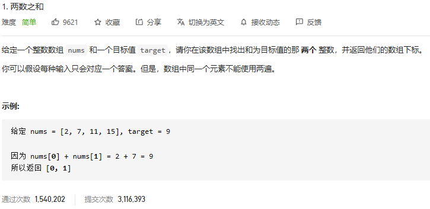

### leetcode_1_easy_两数之和



题目，寻找两数之和，可以理解为，对于每一个数n，寻找有没有target-n这个数在数组中。

**unordered_map**可以用于**查找**操作，时间复杂度**O(1)**。

注意，同一个元素不能使用两遍，所以加上判断语句i!=iter->second。

注意，这题和升序数组中寻找两数之和的题目并不相同。sort之后，原数组各个元素的位置信息就丢失了。

```c++
class Solution {
public:
	vector<int> twoSum(vector<int>& nums, int target) {
		int i;
		unordered_map<int, int> pos;  //数字到位置的映射
		unordered_map<int, int>::iterator iter;
		for (i = 0; i < nums.size(); i++)
			pos[nums[i]] = i;
		for (i = 0; i < nums.size(); i++)
		{
			iter = pos.find(target - nums[i]);
			if (iter != pos.end()&&i!=iter->second)  //注意判断同一个元素不要使用两遍
				return vector<int>{i, iter->second};
		}
		return vector<int>{-1, -1};
	}
};
```

