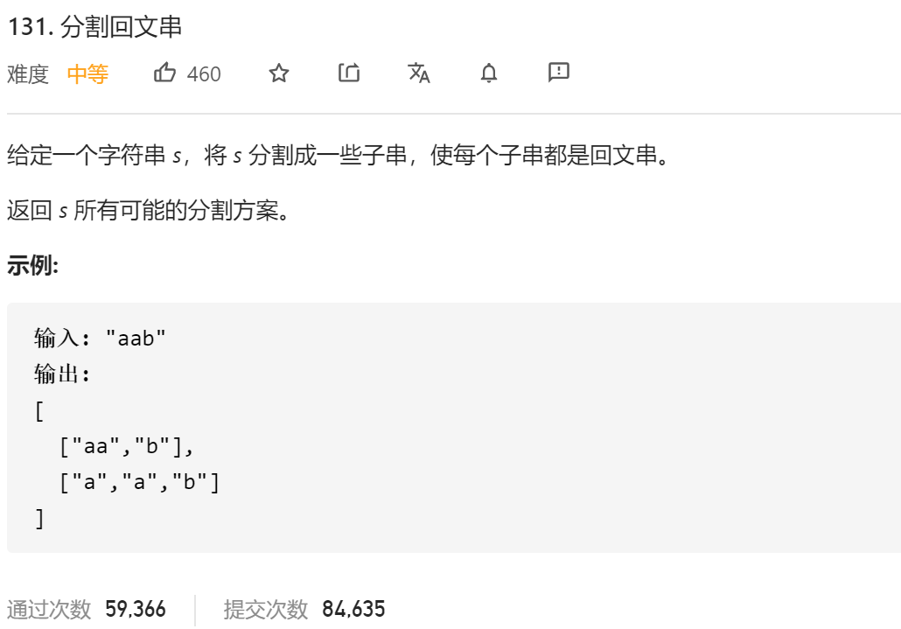

### leetcode_131_medium_分割回文串



```c++
class Solution {
public:
    vector<vector<string>> partition(string s) {

    }
};
```

#### 算法思路

首先应想到回溯算法。当讨论到每一个字符的时候，该字符与后续字符形成回文串，有若干种情况，每个情况都是一个不同的分支。

如示例中，第0个字符'a'，可以形成回文串"a"或回文串“aa”。

但是，对于每个字符可以形成的回文串，需要单独讨论，并用hashmap存储。具体见代码

```c++
class Solution {
public:
	vector<vector<string>> partition(string s) {
		int i, l, r,size;
		vector<string> curPartition;
		vector<vector<string>> result;
		unordered_map<int, vector<int>> end;  //对于s的每一个位置，存储 可以形成回文串的位置区间 的末尾
		
		//记录回文串的可能情况
		size = s.size();
		for (i = 0; i < size; i++)
		{
			for (l = i, r = i + 1; l >= 0 && r < size&&s[l]==s[r]; l--, r++)  //以i为中左元素的 长度为偶数的回文串
				end[l].push_back(r);
			for (l = i, r = i; l >= 0 && r < size&&s[l] == s[r]; l--, r++)  //以i为中心元素的 长度为奇数的回文串
				end[l].push_back(r);
		}
		//回溯算法，构造所有可能的分割方案
		backtrack(0, s, end, curPartition, result);
		return result;
	}

	void backtrack(int cIndex, string &s, unordered_map<int, vector<int>> &end, vector<string> &curPartition, vector<vector<string>> &result)
	{
		int i;

		if (cIndex == s.size())
		{
			result.push_back(curPartition);
			return;
		}
		for (i = 0; i < end[cIndex].size(); i++)
		{
			curPartition.push_back(s.substr(cIndex, end[cIndex][i] - cIndex + 1));
			backtrack(end[cIndex][i] + 1, s, end, curPartition, result);
			curPartition.pop_back();
		}
	}
};
```

