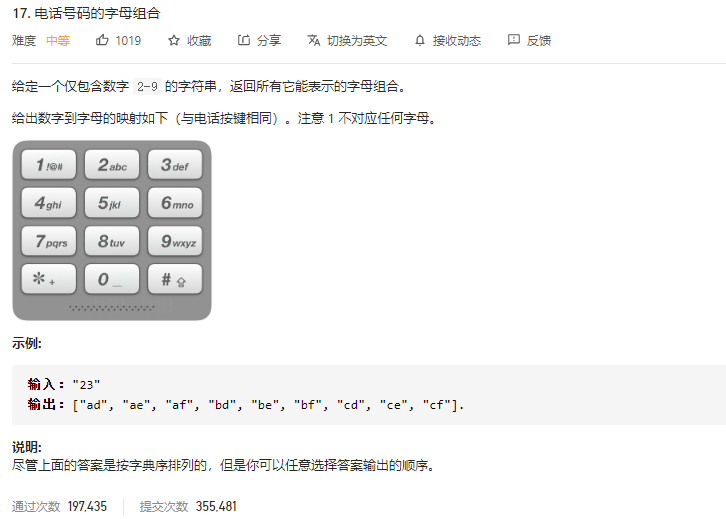

### leetcode_17_medium_电话号码的字母组合



```c++
class Solution {
public:
    vector<string> letterCombinations(string digits) {

    }
};
```

#### 算法思路

经典的回溯算法，套用模板即可。

##### 循环终止条件

注意回溯的函数iterate()的终止条件。每次传入的下标index，都是待处理的数据下标。

当待处理的数据下标越界的时候，意味着到达末尾，可以终止迭代。

##### 数据存储方式

需要存储 数字——对应的字符集 这样一组映射关系。固然可以用unordered_map<char,string>这样的数据结构来存储，但是在unordered_map当中的查找操作也有O(log8)的时间开销。因此，可以使用string[8]这样的数据结构来存储。

记得使用static变量。

```c++
class Solution {
public:
	vector<string> letterCombinations(string digits) {
		string curString = "";
		vector<string> results;
		if(!digits.empty())
			iterate(0, digits, curString, results);
		return results;
	}
	
	void iterate(int index, string& digits, string& curString, vector<string>& results)
	{
		static string letters[8] = { "abc","def","ghi","jkl","mno","pqrs","tuv","wxyz" };
		int i, j;
		if (index == digits.size())  //迭代完成
		{
			results.push_back(curString);
			return;
		}
		i = digits[index] - '2';  //当前数字对应的字符集下标
		for (j = 0; j < letters[i].size(); j++)
		{
			curString = curString + letters[i][j];
			iterate(index + 1, digits, curString, results);
			curString.pop_back();
		}
	}
};
```

