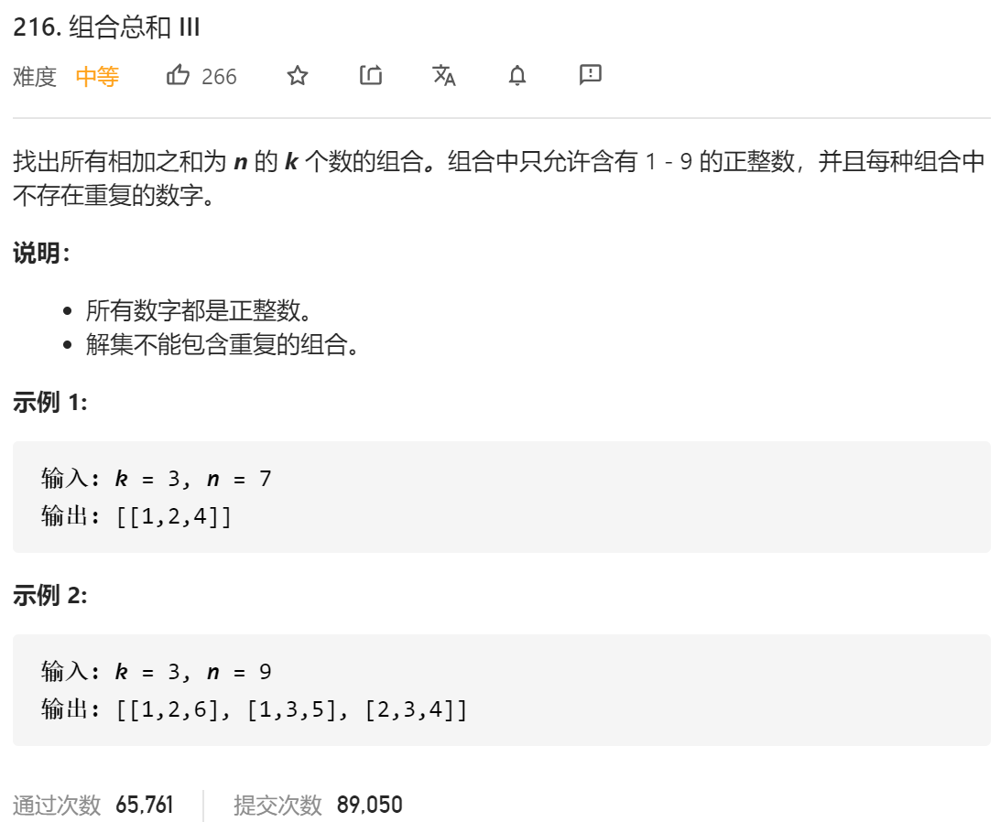

### leetcode_216_medium_组合总数 Ⅲ



```c++
class Solution {
public:
    vector<vector<int>> combinationSum3(int k, int n) {

    }
};
```

#### 算法思路

经典的回溯模板。为了保证组合中不出现重复的数字，不妨规定组合中数字升序

注意剪枝条件

```c++
class Solution {
public:
	vector<vector<int>> combinationSum3(int k, int n) {
		vector<int> curCombine;
		vector<vector<int>> result;

		backtrack(0, k, n, curCombine, result);
		return result;
	}

	//处理到了组合的第index个数。
	void backtrack(int index, int combineSize, int target, vector<int> curCombine, vector<vector<int>> &result)
	{
		int i, minimumSum;
		if (index == combineSize && target == 0)
		{
			result.push_back(curCombine);
			return;
		}

		for (i = curCombine.empty() ? 1 : curCombine[curCombine.size() - 1] + 1;
			i <= target && i<10;
			i++)  //尝试为组合的当前位置 添加各种数字
		{
			//组合的[index,combineSize-1]位置的元素，形成的最小值是否小于target
			minimumSum = (i + i + combineSize - index - 1)*(combineSize - index) / 2;  //(首项+尾项)*项数/2
			if (minimumSum > target)  //这种情况下，组合中后续数字必不满足要求
				break;
			curCombine.push_back(i);
			backtrack(index + 1, combineSize, target - i, curCombine, result);
			curCombine.pop_back();
		}
	}
};
```

