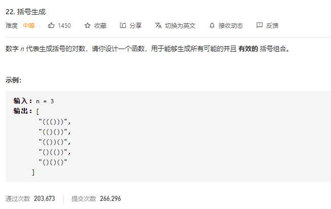

### leetcode_22_medium_括号生成



```c++
class Solution {
public:
    vector<string> generateParenthesis(int n) {

    }
};
```

#### 算法思路

经典的回溯算法

注意点：

- 判断n是否大于0。逻辑上，n=0的时候应该没有有效的括号组合，但是迭代算法会输出一个多余的空字符串""
- 可以叠加右括号的条件是  剩余右括号的数量>剩余左括号的数量。这也隐含着 剩余右括号的数量>1

```c++
class Solution {
public:
	vector<string> generateParenthesis(int n) {
		string curString = "";
		vector<string> results;
		if(n>0)
			iterate(n, n, curString, results);
		return results;
	}

	void iterate(int lLeft, int rLeft, string& curString, vector<string>& results)
	{
		if (lLeft == 0 && rLeft == 0)
		{
			results.push_back(curString);
			return;
		}
		if (lLeft > 0)  //只要左括号还有剩余 就可以插入
		{
			curString = curString + '(';
			iterate(lLeft - 1, rLeft, curString, results);
			curString.pop_back();
		}
		if (rLeft > lLeft)  //可以插入右括号的条件是 剩余右括号的数量>左括号的数量
		{
			curString = curString + ')';
			iterate(lLeft, rLeft - 1, curString, results);
			curString.pop_back();
		}
	}
};
```

