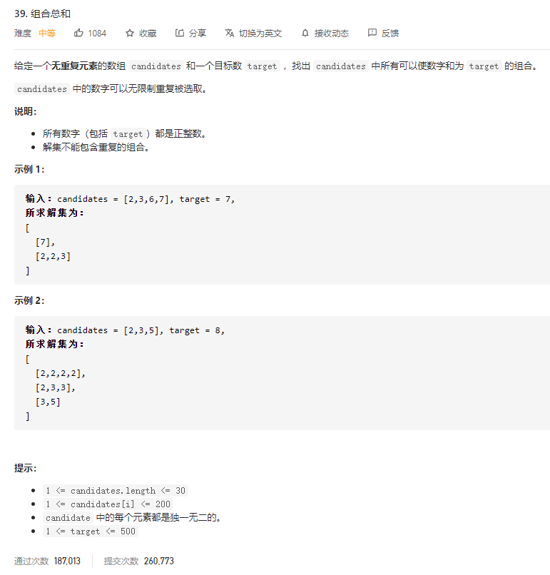
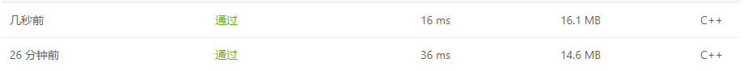

### leetcode_39_medium_组合总数



```c++
class Solution {
public:
    vector<vector<int>> combinationSum(vector<int>& candidates, int target) {

    }
};
```

#### 我的算法

采用**深度优先搜索**，对于candidates里的每一个元素，都分别尝试放入[0,n]到nums数组中。其中，n满足 n*candidates[index]<=target

```c++
class Solution {
public:
	vector<vector<int>> combinationSum(vector<int>& candidates, int target) {
		sort(candidates.begin(), candidates.end());
		vector<int> curNums;
		vector<vector<int>> results;

		DFS(candidates, 0, target, curNums, results);
		return results;
	}

	void DFS(vector<int>& candidates, int index, int target, vector<int> curNums, vector<vector<int>>& results)
	{
		int i;
		if (target == 0)  //找到了符合条件的数组
		{
			results.push_back(curNums);
			return;
		}
		if (index == candidates.size())  //找到末尾 仍然没找到
			return;
		if (candidates[index] > target)  //剪枝。如果当前位置的数>target，那么后续的更大的数也不满足要求
			return;
		while (target >= 0)  //尝试为当前nums加入若干个candidates[index]
		{
			DFS(candidates, index + 1, target, curNums, results);
			target -= candidates[index];
			curNums.push_back(candidates[index]);
		}
	}
};
```

#### 优化后的算法

和上述算法的区别在于，vector<int> curNums改为引用传参。

实际上，在DFS算法中，对于candidates中的每一个元素，都有加入该元素/不加入该元素两种操作。而加入2个以上该元素，可以由两次“加入该元素”操作组合而成。

和上面一种算法对比：

```c++
class Solution {
public:
	vector<vector<int>> combinationSum(vector<int>& candidates, int target) {
		sort(candidates.begin(), candidates.end());
		vector<int> curNums;
		vector<vector<int>> results;

		DFS(candidates, 0, target, curNums, results);
		return results;
	}

	void DFS(vector<int>& candidates, int index, int target, vector<int>& curNums, vector<vector<int>>& results)
	{
		if (target == 0)  //找到了符合条件的数组
		{
			results.push_back(curNums);
			return;
		}
		if (index == candidates.size())  //找到末尾 仍然没找到
			return;
		DFS(candidates, index+1, target, curNums, results);  //一种情况，直接跳过当前元素
		if (candidates[index] <= target)  //另一种情况,加入当前元素
		{
			curNums.push_back(candidates[index]);
			DFS(candidates, index, target - candidates[index], curNums, results);
			curNums.pop_back();
		}
	}
};
```

