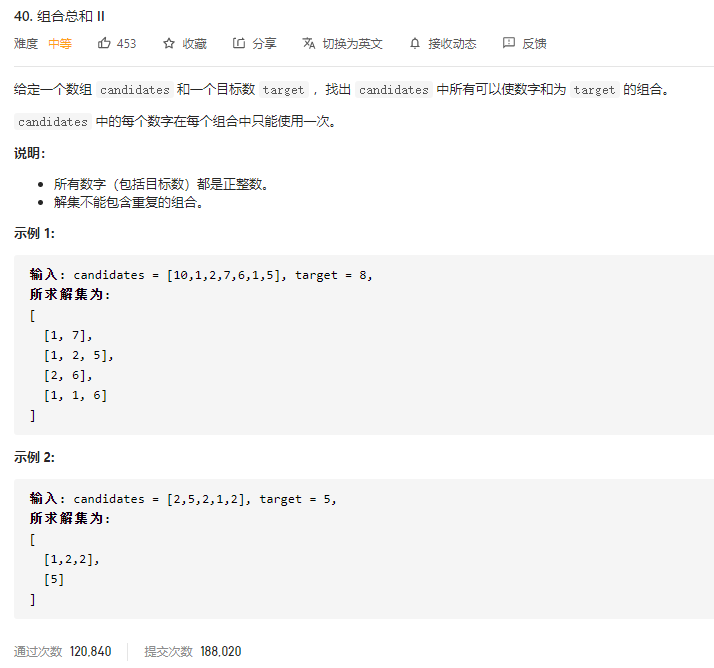
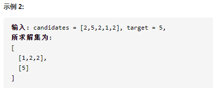

### leetcode_40_medium_组合总数Ⅱ



```
class Solution {
public:
    vector<vector<int>> combinationSum2(vector<int>& candidates, int target) {

    }
};
```

#### 算法思路

类似leetcode_39_medium_组合总和。注意几个点

##### DFS终止条件

需要先判断target==0，是否成功找到了一个组合。再判断index==candidates.size()，找到了末尾仍未找到。

因为存在找到了末尾，且找到了一种组合的情况。比如[1,2,2,2,5]，curNums={5}时，迭代index=5指向了末尾。

##### 避免采用重复元素的方法

例如 ，对于下图中的测试用例



[2,2,1]和[2,1,2]都是合法的组合，但是会造成重复。如何处理？

首先，对candidates进行排序，将[2,5,2,1,2]排序为[1,2,2,2,5]。

对于组合 使用1个或者2个元素“2“都是合法的。那么  优先使用前面的“2”。如果决定不再为组合添加元素"2"，那么后移指针index，使得后面的2也不被使用

```c++
class Solution {
public:
	vector<vector<int>> combinationSum2(vector<int>& candidates, int target) {
		vector<int> curNums;
		vector<vector<int>> results;
		sort(candidates.begin(), candidates.end());
		DFS(candidates, 0, target, curNums, results);
		return results;
	}

	void DFS(vector<int>& candidates, int index, int target, vector<int>& curNums, vector<vector<int>>& results)
	{
		if (target == 0)  //成功找到
		{
			results.push_back(curNums);
			return;
		}
		if (index == candidates.size())  //找到了末尾 仍未找到
		{
			return;
		}
		if (candidates[index] <= target)  //加入candidates[index]的情况
		{
			curNums.push_back(candidates[index]);
			DFS(candidates, index+1, target-candidates[index], curNums, results);
			curNums.pop_back();
		}
		while (index < candidates.size() - 1 && candidates[index] == candidates[index + 1])  //如果决定不用这个数，那么接下来的这个数都不用
			index++;
		DFS(candidates, index+1, target, curNums, results);  //不加入candidates[index]的情况
	}
};
```

