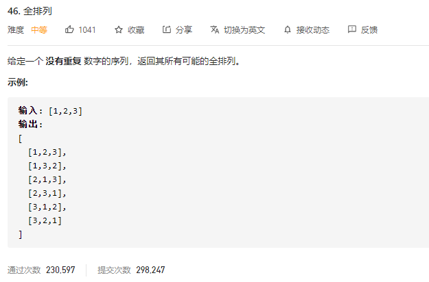

### leetcode_46_medium_全排列



```c++
class Solution {
public:
    vector<vector<int>> permute(vector<int>& nums) {

    }
};
```

#### 算法思路

**回溯**+**搜索**

数字序列 其中的每一个数字 构成搜索空间。对这些数字作深度优先搜索，即可搜索到可能的解。由于答案要的是**所有**可能的全排列，所以进行回溯。

```c++
class Solution {
public:
	vector<vector<int>> permute(vector<int>& nums) {
		int size = nums.size();
		vector<bool> used(size,false);
		vector<int> curNums(size,0);
		vector<vector<int>> results;

		backTrack(0, curNums, nums, used, results);
		return results;
	}

	void backTrack(int index, vector<int>& curNums, vector<int>& nums, vector<bool>&used, vector<vector<int>>& results)
	{
		if (index >= nums.size())
		{
			results.push_back(curNums);
			return;
		}
		for (int i = 0; i < nums.size(); i++)  //为index处尝试各种字符
		{
			if (used[i])
				continue;
			used[i] = true;
			curNums[index] = nums[i];
			backTrack(index + 1, curNums, nums, used, results);
			used[i] = false;
		}
	}
};
```

