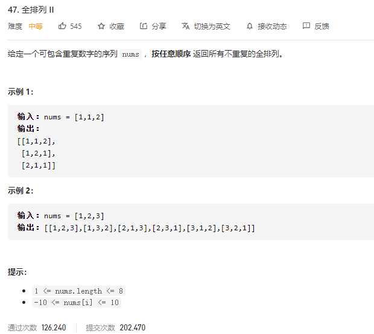

### leetcode_47_medium_全排列Ⅱ



```c++
class Solution {
public:
    vector<vector<int>> permuteUnique(vector<int>& nums) {

    }
};
```

#### 算法思路

与leetcode_46_medium_全排列非常类似，仍然使用**搜索**+**回溯**，在上题的基础上进行一些改动。

首先明确**不重复的全排列**的定义。例如，对于nums=[1,1,2]，为了方便区分，将其记为nums=[1_1,1_2,2]。则，排列[1_1,1_2,2]与排列[1_2,1_1,2]是相同的排列，因为两个数字1只是交换了一下位置。

##### 避免重复排列的方法

为了避免这种情况，规定对于相同的数字，其必须按顺序排列。对于上述例子，也就是，1_1必须出现在1_2之前

如何实现：

1. 对nums进行排序，使得相同的数相邻。例如，将原数组排序为[1_1,1_2,2]
2. 对于生成的每一个排列，都要保证原数组中的相同数是按序排列的。例如，[1_1,2,1_2]是一个合法排列，但是[1_2,2,2_1]并不是一个合法排列
3. 因此，在回溯过程中，当讨论为curNums的第index位置添加元素时
   1. 尝试为它添加nums[i]这个元素（当然，仍然要考虑nums[i]是否使用过）
   2. 当添加完nums[i]，结束了这一组回溯过程，就要试着为index位置添加nums[i]之后的元素
   3. 考虑情况，nums[i]=1_1，nums[i+1]=1_2时。则结束了第2步的回溯，为index位置添加nums[i+1]时，也就意味着在新的全排列里面，1_2可能出现在1_1前面。因此，为了避免这种情况，i向后，直到跳过所有和nums[i]相同的元素
   4. 以另一种语言描述第3步的思路，即，**如果要使用一个元素，就要优先使用前面的元素**。也就是，如果1_1还没有加入排列，那么就不能使用1_2

```c++
class Solution {
public:
	vector<vector<int>> permuteUnique(vector<int>& nums) {
		int size = nums.size();
		vector<bool> used(size,false);
		vector<int> curNums(size,0);
		vector<vector<int>> results;

		sort(nums.begin(), nums.end());  //使得nums相同的字符在相邻的位置
		backTrack(0, curNums, nums, used, results);
		return results;
	}

	void backTrack(int index, vector<int>& curNums, vector<int>& nums, vector<bool>&used, vector<vector<int>>& results)
	{
		if (index >= nums.size())
		{
			results.push_back(curNums);
			return;
		}
		for (int i = 0; i < nums.size(); i++)  //为index处尝试各种字符
		{
			if (used[i])
				continue;
			used[i] = true;
			curNums[index] = nums[i];
			backTrack(index + 1, curNums, nums, used, results);
			used[i] = false;
			while (i < nums.size() - 1 && nums[i] == nums[i + 1])  //跳过重复的字符
				i++;
		}
	}
};
```

