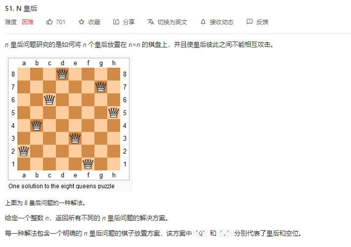
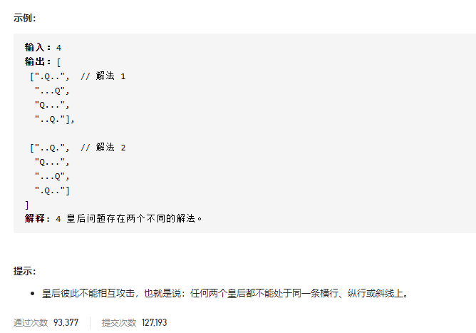

### leetcode_51_hard_N皇后





#### 算法思路

使用**回溯算法**。

当讨论往第y行的某个位置插入元素时，分别讨论往curBoard[y] [x]处插入皇后

可以往curBoard[y] [x]处插入皇后的条件是，该点插入的皇后，不与之前已经插入的皇后冲突

##### 冲突判断

判断curBoard[y] [x]处插入新的皇后是否冲突，实际上就是看[y] [x]这个位置，左上方、正上方、右上方，是否已经有皇后了。

```c++
class Solution {
public:
	vector<vector<string>> solveNQueens(int n) {
		vector<string> curBoard;  //当前的棋盘
		vector<vector<string>> results;
	
		curBoard = vector<string>(n, string(n, '.'));
		backtrack(0, curBoard, n, results);
		return results;
	}

	void backtrack(int y, vector<string>& curBoard, int size, vector<vector<string>>& results)
	{
		bool conflict;  //新加入的棋子 是否和棋盘上已有的棋子冲突
		int x, newX, newY, dir, radius;
		static int dx[3] = { -1,0,1 };
		static int dy[3] = { -1,-1,-1 };

		if (y == size)
		{
			results.push_back(curBoard);
			return;
		}
		for (x = 0; x < size; x++)  //分别尝试这一行的每个位置
		{
			//新加入的棋子 在三个方向上(左上、上、右上)是否冲突
			conflict = false;
			for (dir = 0; dir < 3; dir++)
			{
				if (conflict)
					break;
				newX = x;
				newY = y;
				for (radius = 0; radius < size; radius++)
				{
					newX += dx[dir];
					newY += dy[dir];
					if (newX < 0 || newX >= size || newY < 0 || newY >= size)  //越界的情况
						break;
					if (curBoard[newY][newX] == 'Q')
					{
						conflict = true;
						break;
					}
				}
			}
			if (conflict)
				continue;
			//该位置放置皇后的基础上，继续搜索
			curBoard[y][x] = 'Q';
			backtrack(y + 1, curBoard, size, results);
			curBoard[y][x] = '.';
		}
	}
};
```

