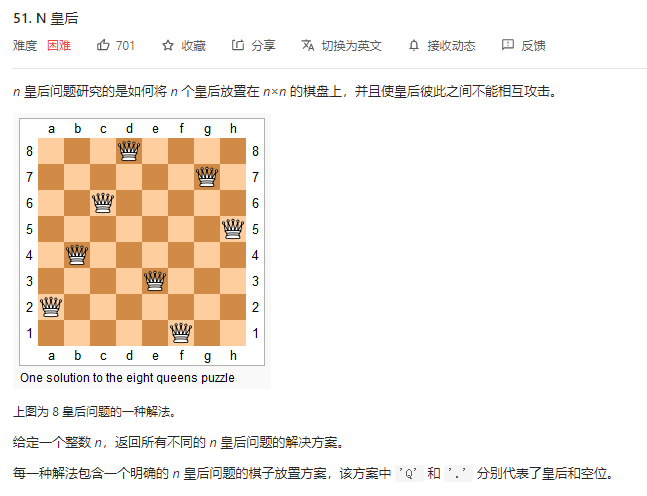
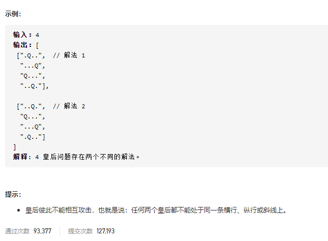

### leetcode_52_hard_N皇后Ⅱ





```c++
class Solution {
public:
    int totalNQueens(int n) {

    }
};
```


#### 算法思路

与leetcode_51_hard_N皇后 几乎一模一样，不再赘述

```c++
class Solution {
public:
	int totalNQueens(int n) {
		vector<string> curBoard;  //当前的棋盘
		int result;
	
		curBoard = vector<string>(n, string(n, '.'));
		result = 0;
		backtrack(0, curBoard, n, result);
		return result;
	}

	void backtrack(int y, vector<string>& curBoard, int size, int& result)
	{
		bool conflict;  //新加入的棋子 是否和棋盘上已有的棋子冲突
		int x, newX, newY, dir, radius;
		static int dx[3] = { -1,0,1 };
		static int dy[3] = { -1,-1,-1 };

		if (y == size)
		{
			result++;
			return;
		}
		for (x = 0; x < size; x++)  //分别尝试这一行的每个位置
		{
			//新加入的棋子 在三个方向上(左上、上、右上)是否冲突
			conflict = false;
			for (dir = 0; dir < 3; dir++)
			{
				if (conflict)
					break;
				newX = x;
				newY = y;
				for (radius = 0; radius < size; radius++)
				{
					newX += dx[dir];
					newY += dy[dir];
					if (newX < 0 || newX >= size || newY < 0 || newY >= size)  //越界的情况
						break;
					if (curBoard[newY][newX] == 'Q')
					{
						conflict = true;
						break;
					}
				}
			}
			if (conflict)
				continue;
			//该位置放置皇后的基础上，继续搜索
			curBoard[y][x] = 'Q';
			backtrack(y + 1, curBoard, size, result);
			curBoard[y][x] = '.';
		}
	}
};
```

