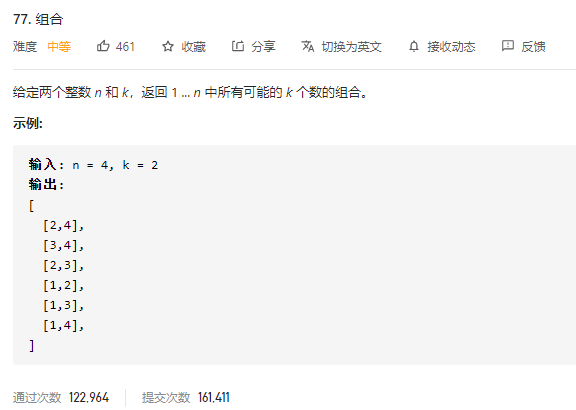

### leetcode_77_medium_组合



```c++
class Solution {
public:
    vector<vector<int>> combine(int n, int k) {

    }
};
```

#### 回溯算法

基础的回溯算法

注意**剪枝**条件。要满足 剩余区间内的字符数量>=仍然需要添加的字符数量。max- i +1>=targetLength-curArray.size()。换算过来，就是i <= max - targetLength + curArray.size()+1

```c++
class Solution {
public:
	vector<vector<int>> combine(int n, int k) {
		vector<int> curArray;
		vector<vector<int>> results;
		backTrack(1, n, k, curArray, results);
		return results;
	}
	
	void backTrack(int least, int max, int targetLength, vector<int>& curArray, vector<vector<int>>& results)
	{
		if (curArray.size() == targetLength)
		{
			results.push_back(curArray);
			return;
		}

		for (int i = least; i <= max - targetLength + curArray.size() + 1; i++)
		{
			curArray.push_back(i);
			backTrack(i + 1, max, targetLength, curArray, results);
			curArray.pop_back();
		}
	}
};
```

