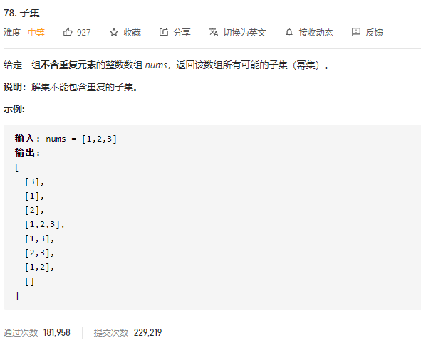

### leetcode_78_子集 _medium



```c++
class Solution {
public:
    vector<vector<int>> subsets(vector<int>& nums) {

    }
};
```

#### 回溯算法

对于每个数nums[index]，存在加入与不加入两个分支

```c++
class Solution {
public:
	vector<vector<int>> subsets(vector<int>& nums) {
		vector<int> curArray;
		vector<vector<int>> results;
		backtrack(0, curArray, nums, results);
		return results;
	}

	void backtrack(int index, vector<int>& curArray,vector<int>&nums, vector<vector<int>>& results)
	{
		if (index == nums.size())
		{
			results.push_back(curArray);
			return;
		}
		backtrack(index + 1, curArray,nums, results);
		curArray.push_back(nums[index]);
		backtrack(index + 1, curArray, nums, results);
		curArray.pop_back();
	}
};
```

