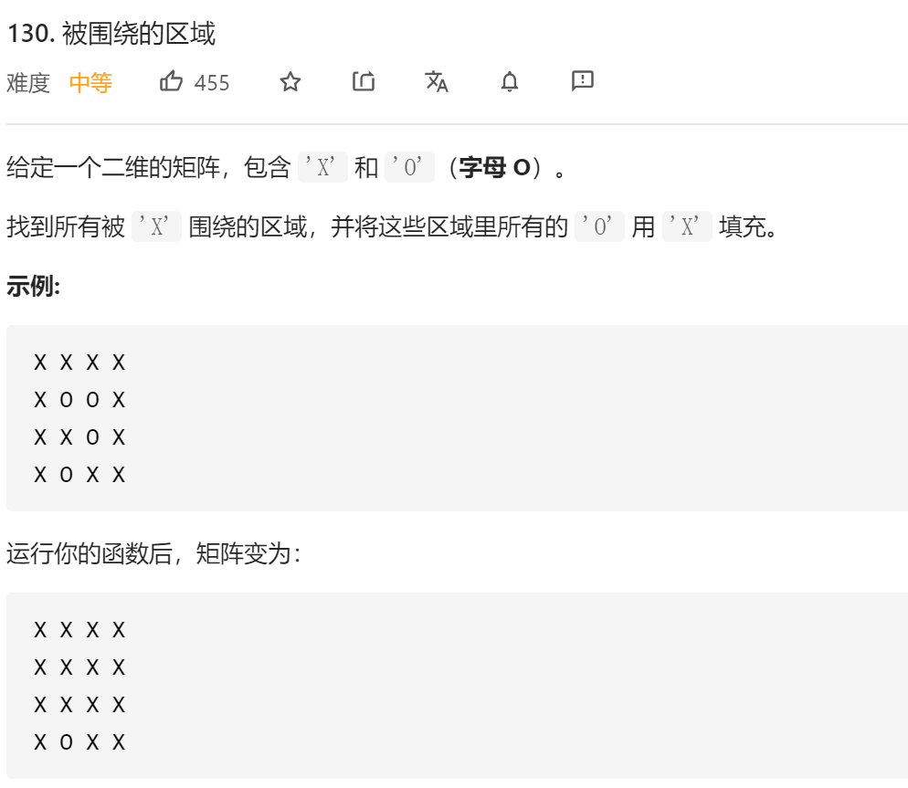

### leetcode_130_medium_被围绕的区域




```c++
class Solution {
public:
    void solve(vector<vector<char>>& board) {
        
    }
};
```

#### 算法思路

换个角度，题目可以这样理解。对于由'O'组成的区域 有两种情况

- 该区域由'X'包围。需要将这些'O'变为'X'
- 该区域连接到边界。无需将这些'O'变为'X'

只需讨论第二种情况即可。将与边界相连的'O'区域 都标记起来。剩下的'O'区域，也就可以全部转化为'X'了。

```c++
class Solution {
public:
	void solve(vector<vector<char>>& board) {
		int width, height, y, x;

		if (board.empty() || board[0].empty())
			return;
		height = board.size();
		width = board[0].size();
		//标记所有与边界连接的'O'区域
		for (y = 0; y < height; y++)
		{
			if (board[y][0] == 'O')
				DFS(y, 0, board);
			if (board[y][width - 1] == 'O')
				DFS(y, width - 1, board);
		}
		for (x = 0; x < width; x++)
		{
			if (board[0][x] == 'O')
				DFS(0, x, board);
			if (board[height - 1][x] == 'O')
				DFS(height - 1, x, board);
		}
		//将'O'或'o'区域，变为对应的'X'或'O'
		for (y = 0; y < height; y++)
		{
			for (x = 0; x < width; x++)
			{
				if (board[y][x] == 'O')
					board[y][x] = 'X';
				else if (board[y][x] == 'o')
					board[y][x] = 'O';
			}
		}
	}

	//从某个区域开始，将所有邻接的'O'，都标记为'o'
	void DFS(int y, int x, vector<vector<char>> &board)
	{
		int width = board[0].size(), height = board.size();
		if (y < 0 || y >= height || x < 0 || x >= width)
			return;
		if (board[y][x] == 'O')
		{
			board[y][x] = 'o';
			DFS(y - 1, x, board);
			DFS(y + 1, x, board);
			DFS(y, x - 1, board);
			DFS(y, x + 1, board);
		}
	}
};
```

