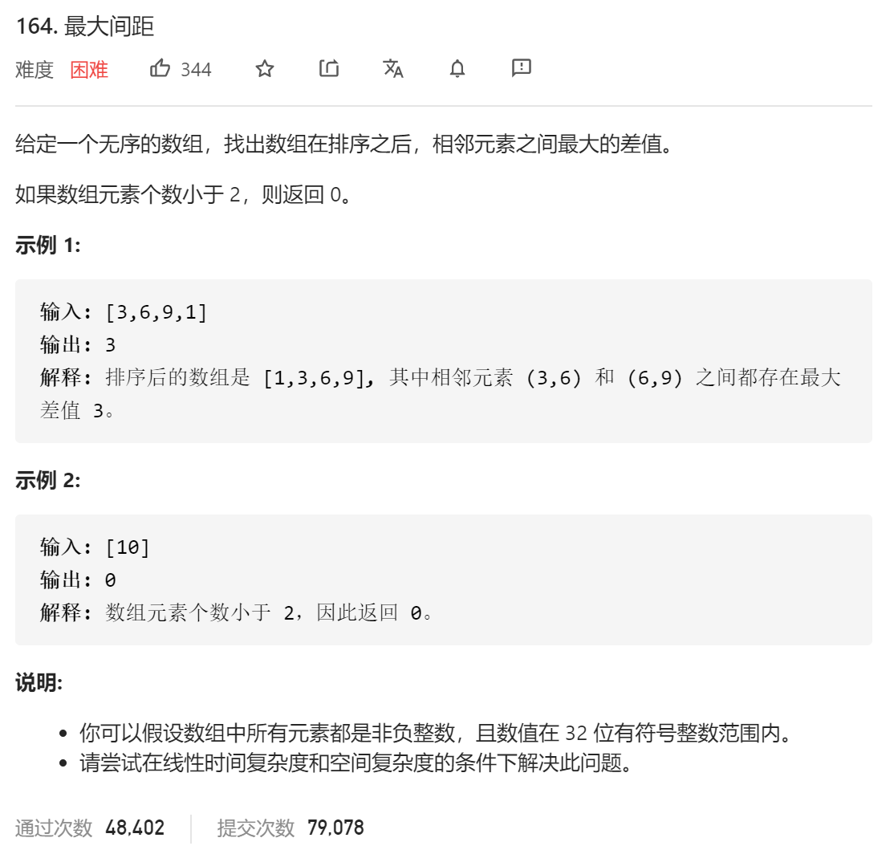

### leetcode_164_hard_最大间距



```c++
class Solution {
public:
    int maximumGap(vector<int>& nums) {

    }
};
```

#### 基于桶的算法

一般的排序算法，均需要O(logN)的时间复杂度，不满足题目要求的 O(N)的时空复杂度。但是题目中要求的找出“最大间距”，是一个比排序更弱的要求。

记数组中元素的最小值、最大值 分别为min、max，则易证最大间距不小于(max-min)/(N-1)。因此，不妨将数据存储到size为(max-min)/(N-1)的桶中。易证，最大间距一定出现在桶与桶之间。

```c++
class Solution {
public:
	int maximumGap(vector<int>& nums) {
		int i,index,minVal, maxVal, N,bucketSize,bucketNum,result,former;
		vector<pair<int, int>> bucket;  //桶，分别存放每个区间数据的最小值和最大值

		//桶的初始化
		N = nums.size();
		if (N <= 1)
			return 0;
		minVal = *min_element(nums.begin(), nums.end());
		maxVal = *max_element(nums.begin(), nums.end());
		bucketSize = max((maxVal - minVal) / (N - 1),1);  //桶的容量(向下取整)
		bucketNum = (maxVal - minVal) / bucketSize+1;  //桶的数量
		bucket = vector<pair<int, int>>(bucketNum, pair<int, int>{-1, -1});
		//统计每个区间数据的最小值和最大值
		for (i = 0; i < nums.size(); i++)
		{
			index = (nums[i]-minVal) / bucketSize;  //将被分配到的桶的下标
			if (bucket[index].first == -1)  //桶中无元素
				bucket[index] = { nums[i],nums[i] };
			else
			{
				bucket[index].first = min(bucket[index].first, nums[i]);
				bucket[index].second = max(bucket[index].second, nums[i]);
			}
		}
		//统计最大间距
		former = minVal;  //之前访问的区间的最大值
		result = 0;
		for (index = 0; index < bucketNum; index++)
		{
			if (bucket[index].first == -1)  //桶中无元素
				continue;
			result = max(result, bucket[index].first - former);
			former = bucket[index].second;
		}

		return result;
	}
};
```

