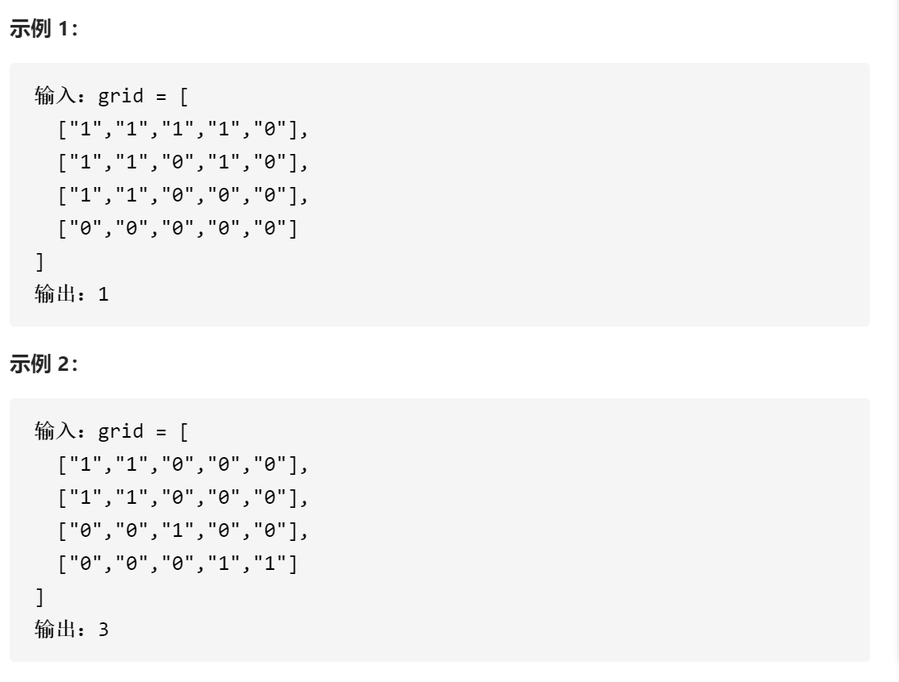
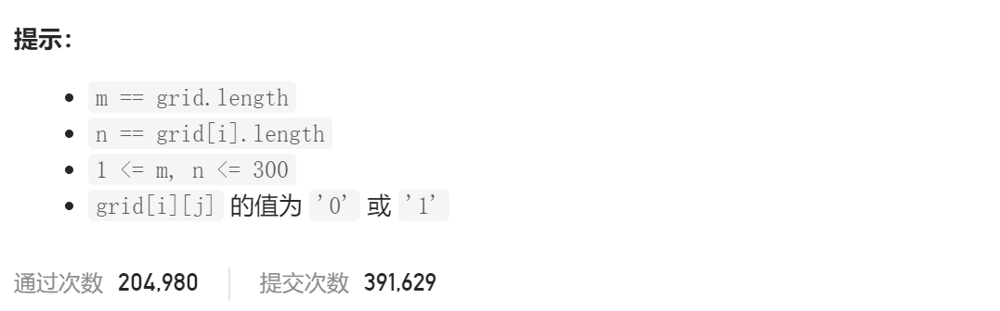

### leetcode_200_medium_岛屿数量






```c++
class Solution {
public:
    int numIslands(vector<vector<char>>& grid) {

    }
};
```

#### 算法思路

每当找到一块陆地 就进行DFS，将与这一块陆地相邻的区域 也就是一整个岛屿，都设置为水

```c++
class Solution {
public:
	int numIslands(vector<vector<char>>& grid) {
		int y, x, height = grid.size(), width = grid[0].size(), result = 0;

		for (y = 0; y < height; y++)
		{
			for (x = 0; x < width; x++)
			{
				if (grid[y][x] == '1')
				{
					result++;
					DFS(grid, y, x);
				}
			}
		}
		return result;
	}

	//从某点陆地开始，将相邻区域均设置为水面
	void DFS(vector<vector<char>>& grid, int y, int x)
	{
		if (y < 0 || y >= grid.size()
			|| x < 0 || x >= grid[0].size())
			return;
		if (grid[y][x] == '0')
			return;
		grid[y][x] = '0';  //将该点设置为水面
		DFS(grid, y, x - 1);
		DFS(grid, y, x + 1);
		DFS(grid, y - 1, x);
		DFS(grid, y + 1, x);
	}
};
```

