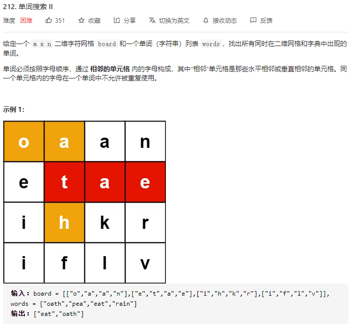
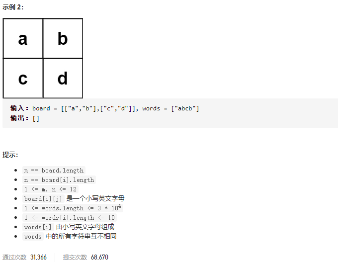

### leetcode_212_hard_单词搜索Ⅱ.md





```c++
class Solution {
public:
    vector<string> findWords(vector<vector<char>>& board, vector<string>& words) {

    }
};
```

#### 算法思路

经典DFS。对于每一个单词，尝试从每一个位置开始DFS搜索。

注意，一旦成功找出了某个单词，则停止在其他位置搜索这个单词

```c++
class Solution {
public:
	vector<string> findWords(vector<vector<char>>& board, vector<string>& words) {
		bool flag;  //指示当前讨论的单词 是否已被找到
		int y, x, i;
		vector<vector<bool>> used;
		vector<string> result;

		height = board.size();
		width = board[0].size();
		used = vector<vector<bool>>(height, vector<bool>(width, false));

		for (i = 0; i < words.size(); i++)
		{
			flag = false;
			for (y = 0; y < height && !flag; y++)
			{
				for (x = 0; x < width && !flag; x++)
				{
					if (DFS(board, used, words[i], 0, y, x))
					{
						result.push_back(words[i]);
						flag = true;
					}
				}
			}
		}
		return result;
	}

	bool DFS(vector<vector<char>> &board, vector<vector<bool>> &used, string &word, int index, int y, int x)
	{
		bool result = false;
		if (index == word.size())  //成功找完了每一个字母
			return true;
		if (y < 0 || y >= height || x < 0 || x >= width)  //到达了边界，该点不能使用
			return false;
		if (used[y][x] == true || board[y][x] != word[index])  //该点的数据不对
			return false;
		used[y][x] = true;
		if (DFS(board, used, word, index + 1, y - 1, x)
			|| DFS(board, used, word, index + 1, y + 1, x)
			|| DFS(board, used, word, index + 1, y, x - 1)
			|| DFS(board, used, word, index + 1, y, x + 1))
			result = true;
		used[y][x] = false;
		return result;
	}
private:
	int width;
	int height;
};
```

