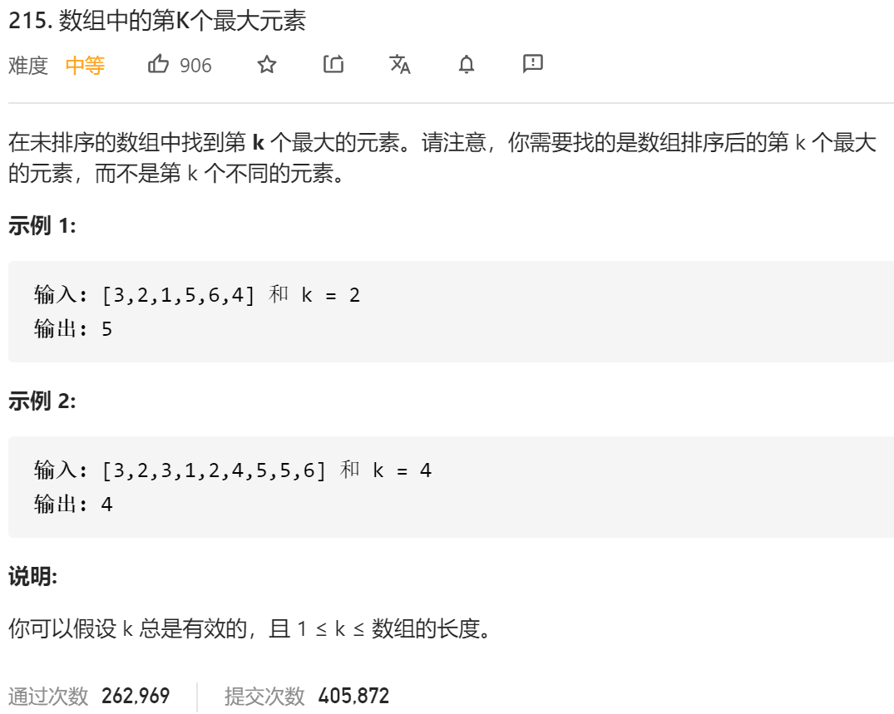

### leetcode_215_medium_数组中的第k个最大的元素



```c++
class Solution {
public:
    int findKthLargest(vector<int>& nums, int k) {

    }
};
```

#### 算法思路

排序时间复杂度O(n*logN)，这种可以放取到第k个最大元素，但是时间复杂度不符合要求。

考虑使用堆排序，维护一个大小为k的小顶锥，存储数组目前遍历过的部分，前k大的元素。在遍历过程中

- 如果遇到比堆顶元素小的数据，则直接跳过
- 如果遇到比堆顶元素大的元素，则移除堆顶元素，并插入新元素

每次插入操作O(logK)。移除操作O(logk)，遍历完数组 总的时间复杂度O(n*logk)。时间复杂度更优

```c++
class Solution {
public:
	int findKthLargest(vector<int>& nums, int k) {
		int i;
		priority_queue<int, vector<int>, greater<int>> heap;  //大小为k的小顶堆

		//用前k个元素 初始化堆
		for (i = 0; i < k; i++)
			heap.push(nums[i]);
		//遍历元素 维护堆
		for (i = k; i < nums.size(); i++)
		{
			if (nums[i] <= heap.top())
				continue;
			heap.pop();
			heap.push(nums[i]);
		}
		//堆顶元素即第k大的元素
		return heap.top();
	}
};
```

