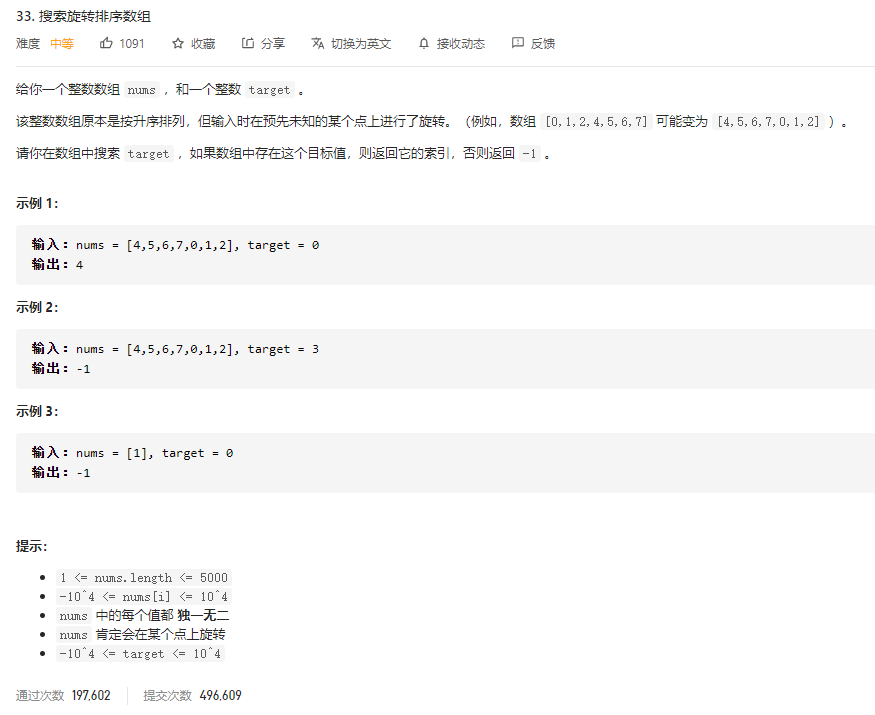

### leetcode_33_medium_搜索旋转排序数组.md



```c++
class Solution {
public:
    int search(vector<int>& nums, int target) {

    }
};
```

#### 算法思路

**二分查找**

##### 查找翻转位置

翻转位置n，满足nums[n]>nums[n+1]。如果找不到翻转位置，则返回数组的最后一个位置。

注意判断终止条件，如果子数组的长度<=2，则找到了翻转位置。

##### 查找指定数

在有序数组中查找target，基础的二分查找即可。

以发生反转的位置pos为界，可以将原数组分割为两个有序数组。判断target与nums[0]的大小关系，以决定在哪个有序数组中寻找target

```c++
class Solution {
public:
	int search(vector<int>& nums, int target) {
		int pos;
		//查找翻转位置
		if (nums[0] <= nums[nums.size() - 1])  //数组没有翻转
			pos = nums.size() - 1;
		else
			pos = flipPos(nums, 0, nums.size() - 1);
		//在有序数组中找target
		if (target >=nums[0])
			return searchNum(nums, target, 0, pos);
		else
			return searchNum(nums, target, pos + 1, nums.size() - 1);
	}

	//查找数组翻转的位置
	int flipPos(vector<int>& nums, int left, int right)
	{
		int mid;
		if (right - left <= 1)  //数组长度为2 则找到了
			return left;
		//if(nums[left]<nums[right])
		mid = (left + right) / 2;
		if (nums[left] > nums[mid])  //翻转出现在左边一半数组
			return flipPos(nums, left, mid);
		else  //翻转出现在右边一半数组
			return flipPos(nums, mid, right);
	}

	//在有序数组中，二分查找某个数的位置
	int searchNum(vector<int>& nums, int target, int left, int right)
	{
		int mid;
		while (left <= right)
		{
			mid = (left + right) / 2;
			if (target == nums[mid])
				return mid;
			else if (target < nums[mid])
				right = mid - 1;
			else
				left = mid + 1;
		}
		return -1;
	}
};
```

