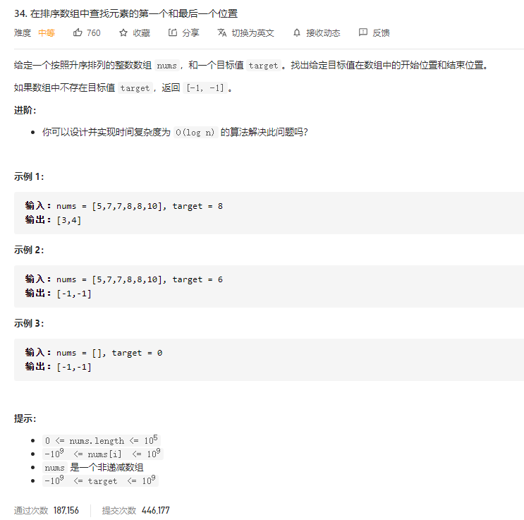

### leetcode_34_medium_在排序树组中查找元素的第一个和最后一个位置



```c++
class Solution {
public:
    vector<int> searchRange(vector<int>& nums, int target) {

    }
};
```

#### 算法思路

首先，二分查找，找到一个值为target的位置。

之后，分别向左 向右 扩展指针