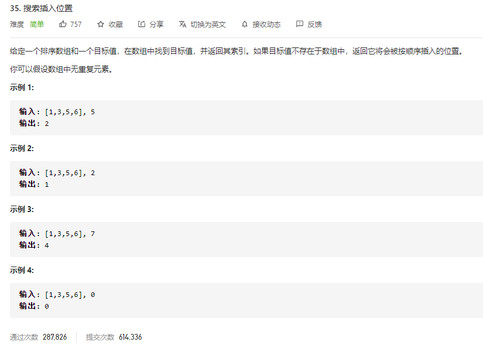

### leetcode_35_easy_搜索插入位置



```c++
class Solution {
public:
    int searchInsert(vector<int>& nums, int target) {

    }
};
```

#### 算法思路

二分查找，查找目标值。

主要是没找到的情况下，如何返回要插入的位置。没找到的情况下，target应该需要插入mid的左侧或者右侧。如果target<nums[mid]则插入左侧。如果target>nums[mid]则插入右侧

```c++
class Solution {
public:
	int searchInsert(vector<int>& nums, int target) {
		int left, right, mid;

		if (nums.empty())
			return 0;
		left = 0;
		right = nums.size() - 1;
		while (left <= right)
		{
			mid = (left + right) / 2;
			if (target == nums[mid])
				return mid;
			else if (target < nums[mid])
				right = mid - 1;
			else
				left = mid + 1;
		}
		//没找到的情况
		if (target < nums[mid])
			return mid;
		else
			return mid + 1;
	}
};
```

