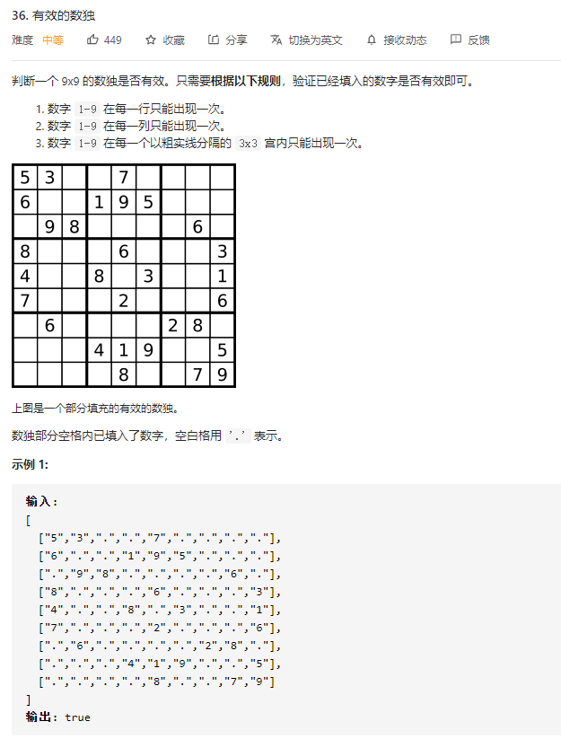
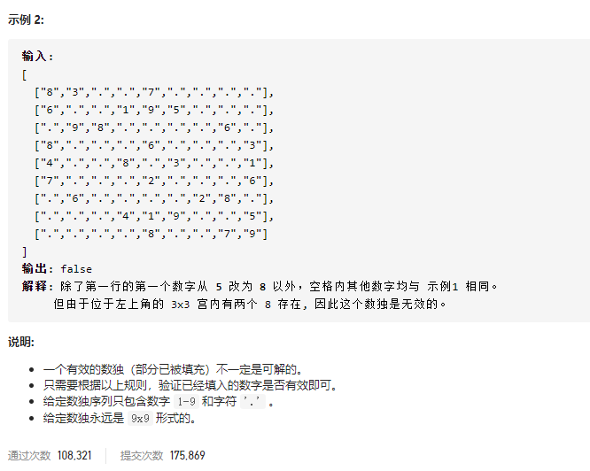

### leetcode_36_medium_有效的数独





```c++
class Solution {
public:
    bool isValidSudoku(vector<vector<char>>& board) {

    }
};
```

#### 分别判断

分别判断每一行、每一列、每一个3*3块，是否符合要求

```c++
class Solution {
public:
    bool isValidSudoku(vector<vector<char>>& board) {
        int used[9];
        int i,j,x,y;
        //检查行列
        for(i=0;i<9;i++)
        {
            //检查行
            memset(used,0,sizeof(int)*9);
            for(j=0;j<9;j++)
            {
                if(board[i][j]=='.')
                    continue;
                if((++used[board[i][j]-'1'])>1)
                    return false;
            };
            //检查列
            memset(used,0,sizeof(int)*9);
            for(j=0;j<9;j++)
            {
                if(board[j][i]=='.')
                    continue;
                if((++used[board[j][i]-'1'])>1)
                    return false;
            }
        }
        //检查3*3块
        for(i=0;i<3;i++)
        {
            for(j=0;j<3;j++)
            {
                memset(used,0,sizeof(int)*9);
                for(y=i*3;y<i*3+3;y++)
                {
                    for(x=j*3;x<j*3+3;x++)
                    {
                        if(board[y][x]=='.')
                            continue;
                        if((++used[board[y][x]-'1'])>1)
                            return false;
                    }
                }
            }
        }
        return true;
    }
};
```

#### 一次迭代

对于每个元素，仅访问一次，就判断该元素是否会导致数独不合法。

那么，需要构造3个数组，存储数独当前的状态

- vector<vector<int>> row(9, vector<int>(9, 0))  统计在每一行中，各个元素出现的次数
- vector<vector<int>> col(9, vector<int>(9, 0))  统计在每一列中，各个元素出现的次数
- vector<vector<int>> box(9, vector<int>(9, 0))  统计在每一个3*3的box中，各个元素出现的次数。box的序号规定如下图


```c++
class Solution {
public:
	bool isValidSudoku(vector<vector<char>>& board) {
		int y, x, val,boxIndex;
		vector<vector<int>> row(9, vector<int>(9, 0));  //每一行出现的各个元素计数
		vector<vector<int>> col(9, vector<int>(9, 0));  //每一列出现的各个元素计数
		vector<vector<int>> box(9, vector<int>(9, 0));  //每个3*3 box出现的元素计数

		for (y = 0; y < 9; y++)
		{
			for (x = 0; x < 9; x++)
			{
				if (board[y][x] == '.')
					continue;
				val = board[y][x] - '1';
				boxIndex = int(y / 3) * 3 + int(x / 3);  //该元素所属的box下标
				if (row[y][val] == 0 && col[x][val] == 0 && box[boxIndex][val] == 0)  //判断元素在每行 每列 每个box 是否重复出现过
				{
					row[y][val] = 1;
					col[x][val] = 1;
					box[boxIndex][val] = 1;
				}
				else
					return false;
			}
		}
		return true;
	}
};
```

