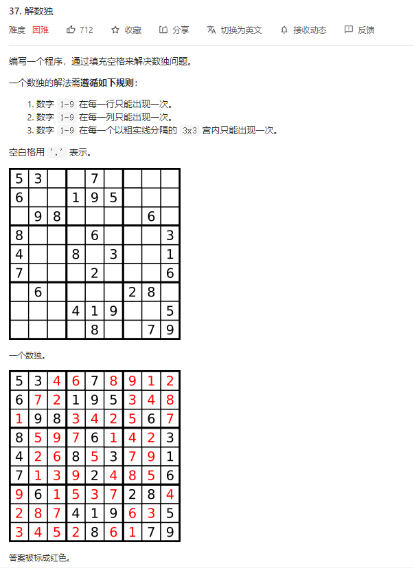
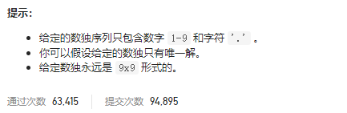

### leetcode_37_hard_解数独



```c++
class Solution {
public:
    void solveSudoku(vector<vector<char>>& board) {
        
    }
};
```

#### 算法思路

很大程度上参考leetcode_36_medium_有效的数独。

##### 数独合法性检查

因为DFS搜索过程中，为空白位置每插入一个数字，都要检查这个数字和当前数独是否冲突，包括是否产生行冲突、列冲突、3*3小数独冲突。因此，想到构造三个数组，用来表示数独当前的状态

- vector<vector<int>> row(9, vector<int>(9, 0))  统计在每一行中，各个元素出现的次数
- vector<vector<int>> col(9, vector<int>(9, 0))  统计在每一列中，各个元素出现的次数
- vector<vector<int>> box(9, vector<int>(9, 0))  统计在每一个3*3的box中，各个元素出现的次数。box的序号规定如下图


首先扫描一遍数独，将所有已经存在的元素，信息更新至row,col,box三个数组中。

##### 深度优先搜索

类比N皇后问题，先扫描一遍整个数组，记录所有的待插入元素的位置。之后，通过深度优先搜索，尝试为每个位置插入元素

DFS函数结构如下

1. 判断数独是否已经构造完毕。通过index==emtpyX.size()判断
2. 获取当前需要插入的元素位置
3. 依次尝试为该位置插入1~9每个数字
   1. 判断在该位置插入该数字，是否与原数独冲突。冲突则跳过
   2. 在row,col,box三个数组中，在该位置插入该数字
   3. 继续DFS搜索
   4. DFS搜索成功，则为board更新该元素，退出
   5. DFS搜索失败，则回退一步