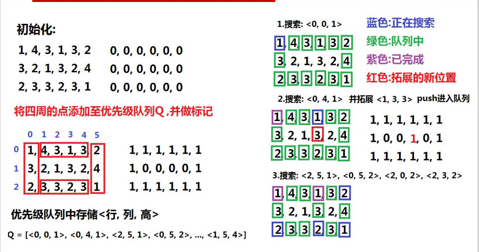
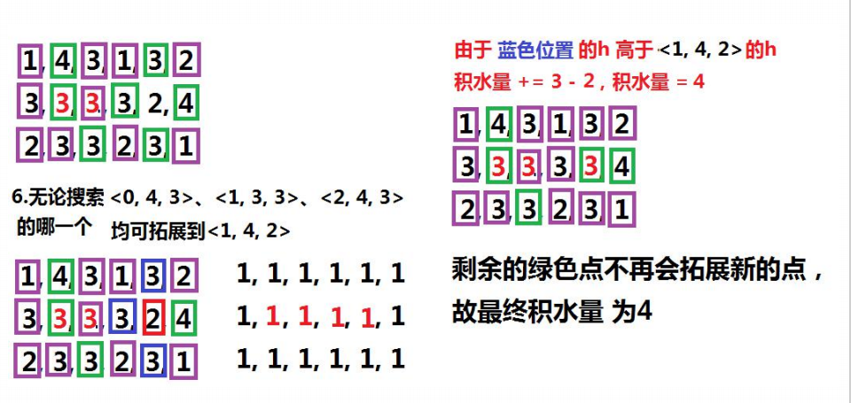

### leetcode_407_hard_接雨水2


```c++
class Solution {
public:
    int trapRainWater(vector<vector<int>>& heightMap) {
        
    }
};
```

#### 算法思路

另外维护一个二维数组waterHeight，记录各个位置的最终高度（包括水平面）。

1. 各个位置的waterMap置为初始值INT_MAX
2. 矩形区域，四条边上的位置，因为水总会向外流出，所以，waterMap的值修改为heightMap，并将这些heightMap加入小顶堆
3. 循环将小顶堆的根节点弹出，每当弹出一个节点时，更新其相邻节点的waterHeight，并加入小顶堆
   - 如果该相邻节点已处理过，则跳过
   - 如果该相邻节点的heightMap>弹出节点的waterMap，即这个单元的高度已经高于水平面了，所以无法积水。waterMap置为其heightMap
   - 如果该节点的heightMap<=弹出节点的waterMap，则该节点可以积水，积水的高度即为弹出节点的waterMap
4. 计算waterMap和heightMap的总的差值，即为区域积水的总量

##### 四条边的waterMap初始值

显然，边缘节点无法积水。所以它们的最终高度，也就是和单元高度一致。

##### 小顶堆的必要性

对于堆中的元素，其waterMap已经确定，不会再改变。

每当取出堆顶元素，讨论该元素，例如waterMap[y] [x]=k。其物理意义也就是，当矩阵y，x处的高度由INT_MAX改为k，那么，这个操作会使得周围的积水量发生什么样的变化。

当讨论waterMap[y] [x]=k所引起的连锁反映时，只需要讨论对其四邻域的影响。因为再向外扩展出的其他区域，会在讨论从堆中取出四邻域元素的时候才讨论到。

取出**小顶堆**的**根节点**，是因为这是当前待讨论的最低处。这个节点的高度定下了，它的四邻域的高度也就随之确定。之后任何更高一些的节点确定高度，都不会影响这之前的四邻域四个元素的值。

##### 流程示例






```c++
class Solution {
public:
	typedef pair<int,pair<int, int>> unitData;  //某个单元的信息<高度,<位置y，位置x>>
	int trapRainWater(vector<vector<int>>& heightMap) {
		int y, x,i, val, result;
		int height = heightMap.size(), width = heightMap[0].size();
		int dx[] = { 0,1,0,-1 }, dy[] = { -1,0,1,0 };
		unitData curUnit;
		priority_queue<unitData, vector<unitData>, greater<unitData>> heap;  //用于存储当前待处理节点的小顶堆
		//vector<vector<int>> waterMap(height, vector<int>(width, INT_MAX));
		vector<vector<bool>> visited(height, vector<bool>(width, false));  //记录每个位置是否被处理过

		//四个边的元素加入堆
		result = 0;
		for (y = 0; y < height; y++)  //左右两条边
		{
			heap.push({ heightMap[y][0],{y,width - 1} });
			heap.push({ heightMap[y][width - 1],{y,width - 1} });
			visited[y][0] = true;
			visited[y][width - 1] = true;
		}
		for (x = 0; x < width; x++)  //上下两条边
		{
			heap.push({ heightMap[0][x],{0,x} });
			heap.push({ heightMap[height - 1][x],{height - 1,x} });
			visited[0][x] = true;
			visited[height - 1][x] = true;
		}
		//处理小顶堆的每一个元素
		while (!heap.empty())
		{
			curUnit = heap.top();
			heap.pop();
			val = curUnit.first;
			for (i = 0; i < 4; i++)  //讨论四邻域的每个元素
			{
				y = curUnit.second.first + dy[i];
				x = curUnit.second.second + dx[i];
				if (x < 0 || x >= width || y < 0 || y >= height || visited[y][x])  //跳过不在范围内/访问过的元素
					continue;
				if(val>heightMap[y][x])  //当前位置更低，可以蓄水，蓄到val的高度
				{
					result += val - heightMap[y][x];
					heightMap[y][x] = val;
				}
				heap.push({ heightMap[y][x],{y,x} });
				visited[y][x] = true;
			}
		}
		return result;
	}

};
```

