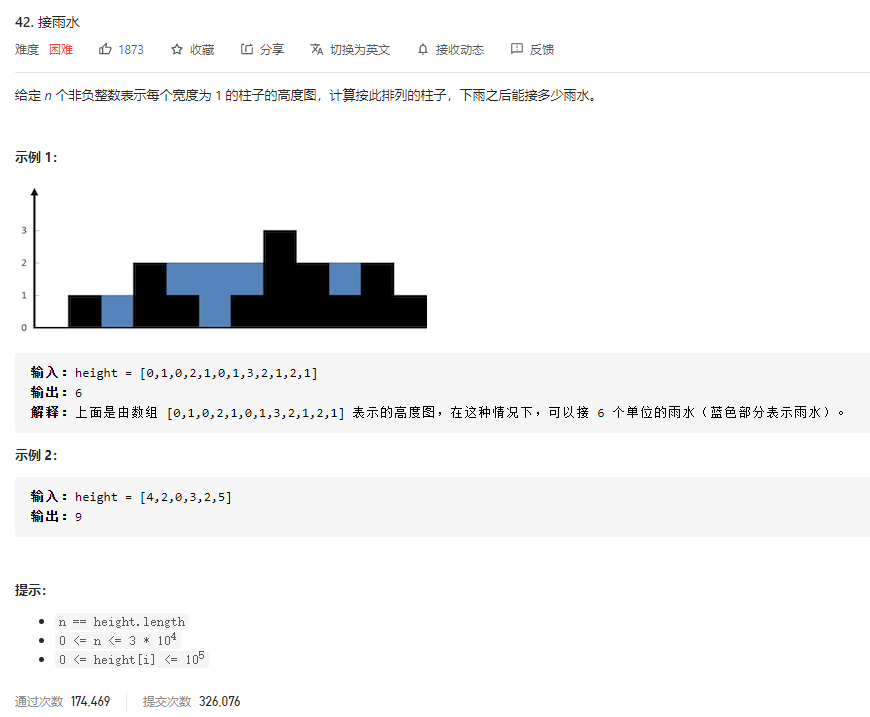

### leetcode_42_hard_接雨水



```c++
class Solution {
public:
    int trap(vector<int>& height) {

    }
};
```

#### 双指针法

用一个waterHeight数组，记录接雨水后，各个格子的高度。

用leftWall，rightWall两个数值，维护当前区域对应的左侧，右侧墙体的最高高度。

用双指针left，right记录当前待处理区间

使用数学归纳法，考虑对于当前的一组left、right、leftWall、rightWall

- 如果leftWall<=rightWall，那么左侧墙壁的高度小于右侧墙壁的高度。区间内的水如果向外流出的话，一定是先从左侧流出。那么，先讨论waterHeight[left+1]的水面高度
  - 如果height[left+1]>height[left]，那么可以更新左侧墙体的高度。而left+1处的水平面高度waterHeight，也就是该点处的墙体高度
  - 如果height[left+1]<=height[left]，那么left+1处的水平面，可以积水到和左侧墙体高度持平为止。也就是waterHeight[left+1]=leftWall
- leftWall>rightWall同理

```c++
class Solution {
public:
	int trap(vector<int>& height) {
		int size = height.size(), left, right, leftWall, rightWall,capicity;
		vector<int> waterHeight(height);  //积水后各个位置的高度
		if (size <= 2)
			return 0;
		left = 0;
		right = size - 1;
		leftWall = height[0];  //左侧墙高度
		rightWall = height[size - 1];  //右侧墙高度
		//计算积水后各个位置的高度
		while (left < right)
		{
			if (leftWall <= rightWall)  //移动左指针
			{
				left++;
				leftWall = max(leftWall, height[left]);
				waterHeight[left] = leftWall;
			}
			else  //移动右指针
			{
				right--;
				rightWall = max(rightWall, height[right]);
				waterHeight[right] = rightWall;
			}
		}
		//计算总积水量
		capicity = 0;
		for (left = 0; left < size; left++)
		{
			capicity += waterHeight[left] - height[left];
		}
		return capicity;
	}
};
```

