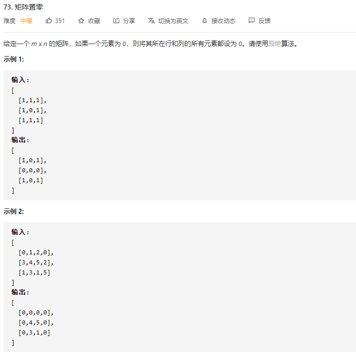
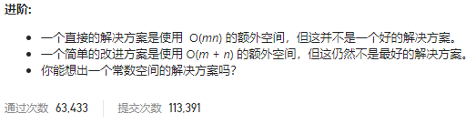
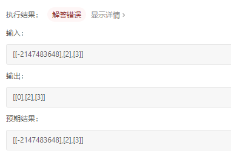

### leetcode_73_medium_矩阵置零





```c++
class Solution {
public:
    void setZeroes(vector<vector<int>>& matrix) {
        
    }
};
```


#### 算法思路

O(mn)额外空间的算法，即建立一个和matrix一样大的result数组

O(m+n)额外空间的算法，即建立一维数组col[n],row[m]，记录每一行，每一列是否有0

以下讨论原地算法：

#### 标志位

“如果一个元素为 0，则将其所在行和列的所有元素都设为 0”。这带来了一个问题，当讨论到某个位置的元素为0的时候，无法区分这个“0”，是本来就为0，还是在算法过程中被置为0.

因此，采用下述方法

1. 第一遍扫描的时候，将每个0所在的行和列置为标志位，例如，INT_MIN。
   - 注意，当扫描到一个0时，向上、下、左、右四个方向，将各个位置置为标志位。**循环终止条件**，设置如果扫描到0则中止。这是为了避免重复设置标志位。
2. 第二遍扫描时，将标志位置为0

此使用标志位INT_MIN被挂在了如下测试用例：



但是，鉴于官方题解也使用了标志位的方法，所以，更换标志位的数值即可

```c++
class Solution {
public:
	void setZeroes(vector<vector<int>>& matrix) {
		int y,x,newY,newX,height, width;
		int MODIFIED = 114514;
		
		if (matrix.empty() || matrix[0].empty())
			return;
		height = matrix.size();
		width = matrix[0].size();

		//第一遍扫描，标记"0"所在的行列
		for (y = 0; y < height; y++)
		{
			for (x = 0; x < width; x++)
			{
				if (matrix[y][x] == 0)
				{
					newY = y-1;
					while (newY >= 0 && matrix[newY][x] != 0)  //向上标记
						matrix[newY--][x] = MODIFIED;
					newY = y + 1;
					while (newY < height&&matrix[newY][x] != 0)  //向下标记
						matrix[newY++][x] = MODIFIED;
					newX = x - 1;
					while (newX >= 0 && matrix[y][newX] != 0)  //向左标记
						matrix[y][newX--] = MODIFIED;
					newX = x + 1;
					while (newX < width&&matrix[y][newX] != 0)  //向右标记
						matrix[y][newX++] = MODIFIED;
				}
			}
		}
		//第二遍扫描，将标志位置为0
		for (y = 0; y < height; y++)
		{
			for (x = 0; x < width; x++)
			{
				if (matrix[y][x] == MODIFIED)
				{
					matrix[y][x] = 0;
				}
			}
		}
	}
};
```

