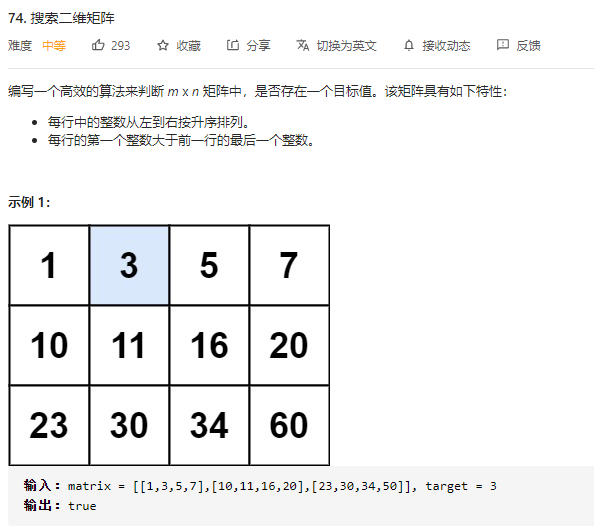

### leetcode_74_medium_搜索二维矩阵




```c++
class Solution {
public:
    bool searchMatrix(vector<vector<int>>& matrix, int target) {

    }
};
```

#### 算法思路

分别二分查找行和列

讨论target所在的行：

- target小于当前行最小元素的情况。target<matrix[mid] [0]。则向前面的行搜索即可。b=mid-1
- target就在当前行的情况。target>=matrix[mid] [0]。且满足以下二者之一
  - mid是最后一行。mid==height-1
  - mid不是最后一行。mid后面的一行，行首元素比target大，即target<matrix[mid+1] [0]
- target大于当前行最大元素的情况。即其他所有情况


二分查找target所在的列。常规方法，不再赘述

```c++
class Solution {
public:
	bool searchMatrix(vector<vector<int>>& matrix, int target) {
		int height, width, y, x, a, b, mid;
		
		if (matrix.empty() || matrix[0].empty())
			return false;
		height = matrix.size();
		width = matrix[0].size();

		//定位行
		a = 0;
		b = height - 1;
		y = -1;
		while (a <= b)
		{
			mid = (a + b) / 2;
			if (target < matrix[mid][0])
				b = mid - 1;
			else if (mid == height - 1 || target < matrix[mid + 1][0])  //找到了的情况
			{
				y = mid;
				break;
			}
			else
				a = mid + 1;
		}
		if (y == -1)
			return false;
		//定位列
		a = 0;
		b = width - 1;
		while (a <= b)
		{
			mid = (a + b) / 2;
			if (target < matrix[y][mid])
				b = mid - 1;
			else if (target == matrix[y][mid])
				return true;
			else
				a = mid + 1;
		}
		return false;
	}
};
```

