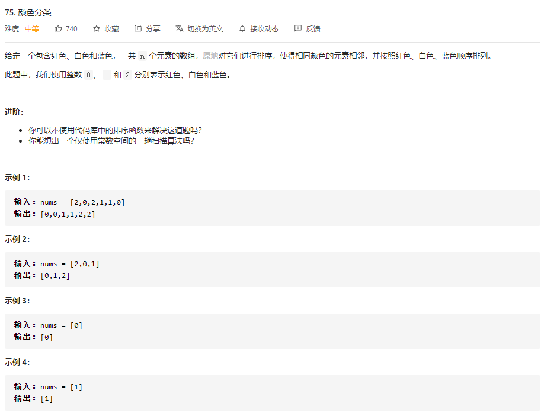
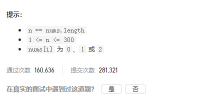

### leetcode_75_medium_颜色分类





```c++
class Solution {
public:
    void sortColors(vector<int>& nums) {
        
    }
};
```

#### 两趟扫描

第一趟扫描，统计各种数字的数量。

第二趟扫描，赋值

```c++
class Solution {
public:
	void sortColors(vector<int>& nums) {
		int i,num0 = 0, num1 = 0, num2 = 0;

		//第一趟扫描，统计数量
		for (i = 0; i < nums.size(); i++)
		{
			if (nums[i] == 0)
				num0++;
			else if (nums[i] == 1)
				num1++;
			else if (nums[i] == 2)
				num2++;
		}
		//第二趟扫描，赋值
		i = 0;
		while (num0 > 0)
		{
			nums[i++] = 0;
			num0--;
		}
		while (num1 > 0)
		{
			nums[i++] = 1;
			num1--;
		}
		while (num2 > 0)
		{
			nums[i++] = 2;
			num2--;
		}
	}
};

```

#### 一趟扫描-方法1

维护两个指针。p0：指向下一个用来放置0的位置；p1：指向下一个用来放置1的位置

当讨论到第i个元素时：

1. 如果nums[i]==2，无需操作
2. 如果nums[i]==1，则交换nums[i]、nums[p1]，就完成了把这个“1”放到它应该在的位置
3. 如果nums[i]==0，首先，交换nums[i]、nums[p0]，这样，完成了把这个"0"放在他应该在的位置。但是，如果已经有一些1被放到前面的话，这样可能会导致，原来在p0位置的“1”被移到了后面。如果发生了这种情况，则需把这个"1"再移动到p1的位置。

```c++
class Solution {
public:
	void sortColors(vector<int>& nums) {
		int i, p0, p1;

		for (i = 0,p0 = 0,p1 = 0;i<nums.size();i++)
		{
			if (nums[i] == 1)
				swap(nums[p1++], nums[i]);
			else if(nums[i]==0)  //nums[i]==0的情况
			{
				swap(nums[p0], nums[i]);  //首先把这个0提到前面
				if (p0 < p1)  //这意味着已经找到一些1了，也就是，上一步的操作把一个1放到了后面
					swap(nums[p1], nums[i]);
				p0++;
				p1++;  //找到了一个0，p1总是要前进的
			}
		}
	}
};
```


#### 一趟扫描-方法2

维护两个指针。p0：指向下一个用来放置0的位置；p2：指向下一个用来放置2的位置

注意，当把nums[i]==2交换到p2处时，交换回来的，新的nums[i]可能是0或1或2，仍需讨论一遍。

```c++
class Solution {
public:
	void sortColors(vector<int>& nums) {
		int i, p0, p2;

		for (i = 0,p0 = 0,p2 = nums.size()-1;i<=p2;i++)
		{
			if (nums[i] == 0)
				swap(nums[i], nums[p0++]);
			else if (nums[i] == 2)
			{
				swap(nums[i], nums[p2--]);
				i--;  //考虑到换过来的数字可能是0或者2。nums[i]要再讨论一遍
			}
		}
	}
};
```

