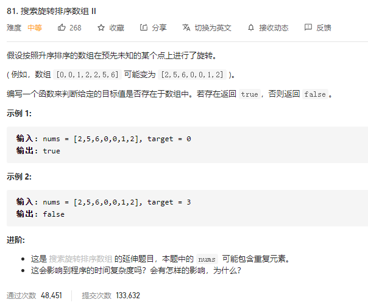

### leetcode_81_medium_搜索旋转排序数组Ⅱ



```c++
class Solution {
public:
    bool search(vector<int>& nums, int target) {
        
    }
};
```

#### 算法思路

1. 二分查找 找到下降点的位置。下降点dropPt满足nums[dropPt]>nums[dropPt+1]。那么 对于二分查找的每一次循环，mid=(l+r)/2。都满足，如果有下降点，则下降点一定在[l,r]区间内
   1. 由于下述二分查找的方法中，每一次查找都会使得区间长度缩短为(原长度+1)/2。所以，当区间长度为2的时候，就不会再缩短。所以，**二分查找循环终止条件**是r-l<=1。此时，对于下降点可能存在的区间[l,r]，下降点只有可能是l
   2. 如果nums[l]>nums[mid]，下降点肯定存在于[l,mid]区间。令r=mid
   3. 对于nums[l]==nums[mid]的情况，无法判断下降点是在左侧还是右侧。例如[1,3,1,1,1]这样一个子区间。那么，放弃nums[l]这样一个重复元素，也不影响最后的判断结果。令l++
   4. 其他情况，即nums[l]<nums[mid]的情况。如果有下降点，也只可能是在右边的一半区间。令l=mid
2. 在有序区间中二分查找目标值

注意，对于第一步，找到下降点的位置。例如升序数组[3,3,3,3,3]，在某一点上进行了旋转之后，并不会形成下降点。这种情况需要单独讨论

[1,3,1,1]