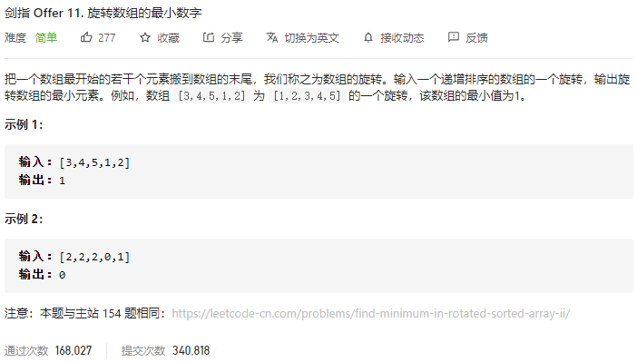

### 剑指offer_11_easy_旋转数组的最小数字



```c++
class Solution {
public:
    int minArray(vector<int>& numbers) {

    }
};
```

#### 算法思路

同leetcode_154_hard_寻找旋转排序数组中的最小值Ⅱ

```c++
class Solution {
public:
    int minArray(vector<int>& numbers) {
        int left,right,mid;

        left=0;
        right=numbers.size()-1;
        while(left<right)
        {
            mid=(left+right)/2;  //向下取整 TODO
            if(numbers[mid]==numbers[right])
                --right;
            else if(numbers[mid]<=numbers[right])
                right=mid;
            else
                left=mid+1;
        }
        return numbers[left];
    }
};
```

