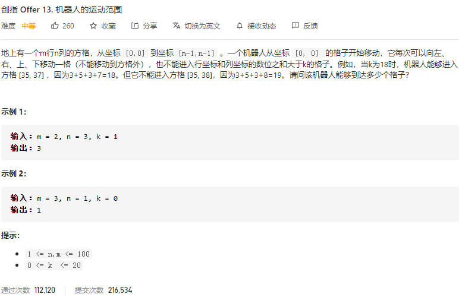

### 剑指offer_13_medium_机器人的运动范围



```c++
class Solution {
public:
    int movingCount(int m, int n, int k) {

    }
};
```

#### 算法思路

考察DFS

```c++
class Solution {
public:
    int movingCount(int m, int n, int k) {
        int result=0;
        this->width=n;
        this->height=m;
        this->k=k;
        vector<vector<bool>> visited(height,vector<bool>(width,false));

        DFS(0,0,result,visited);
        return result;
    }

    void DFS(int y,int x,int &result,vector<vector<bool>> &visited)
    {
        if(!isValid(y,x) || visited[y][x])
            return;
        result++;
        visited[y][x]=true;
        DFS(y-1,x,result,visited);
        DFS(y+1,x,result,visited);
        DFS(y,x-1,result,visited);
        DFS(y,x+1,result,visited);
    }

    //判断某个位置是否合法
    bool isValid(int y,int x)
    {
        int digit,digitSum;
        
        if(y<0||y>=height||x<0||x>=width)
            return false;
        digitSum=0;
        while(y>0)
        {
            digitSum+=y%10;
            y/=10;
        }
        while(x>0)
        {
            digitSum+=x%10;
            x/=10;
        }
        return digitSum<=k;
    }

private:
    int k;
    int width;
    int height;
};
```

