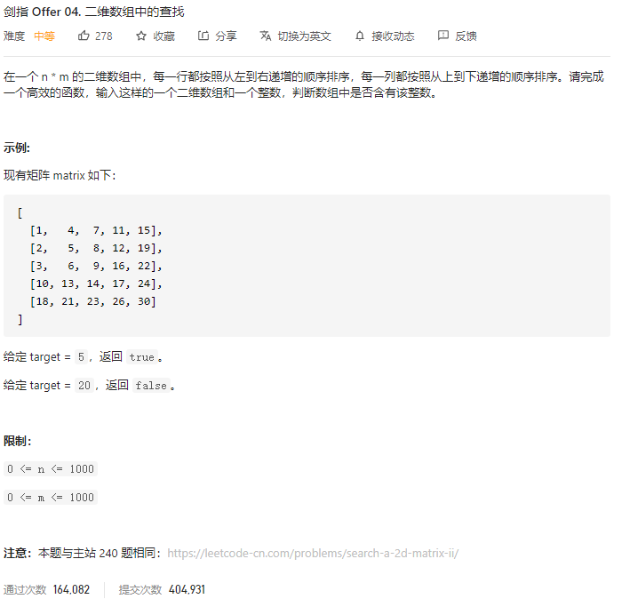

### 剑指offer_4_medium_二维数组中的查找



```c++
class Solution {
public:
    bool findNumberIn2DArray(vector<vector<int>>& matrix, int target) {

    }
};
```

#### 算法思路

注意到 对于矩阵的右上角元素，其正下方的元素比它大，其正左方的元素比他小。则可以通过比较target与右上角元素，来进行查找

- 如果target与右上角元素相等，则成功找到
- 如果target<右上角元素，则排除最右边一列
- 如果target>右上角元素，则排除最上边一行

```c++
class Solution {
public:
    bool findNumberIn2DArray(vector<vector<int>>& matrix, int target) {
        if(matrix.empty() || matrix[0].empty())
            return false;
        int height=matrix.size(),width=matrix[0].size();
        int rightEdge=width-1,upEdge=0;

        while(rightEdge>=0 && upEdge<=height-1)  //判断数组是否访问完毕
        {
            if(target==matrix[upEdge][rightEdge])
                return true;
            else if(target<matrix[upEdge][rightEdge])
                --rightEdge;  //放弃最右边一列
            else
                ++upEdge;  //放弃最上边一行
        }
        return false;
    }
};
```

