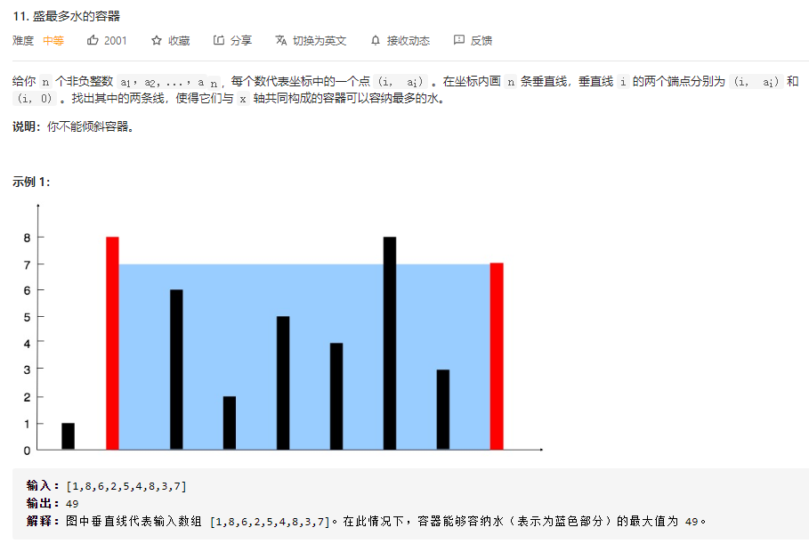
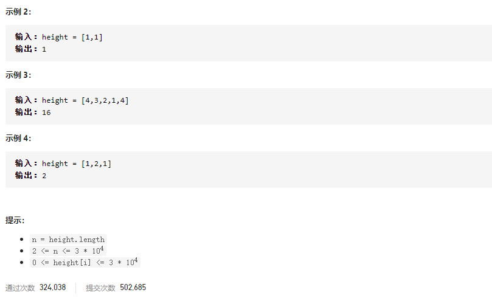
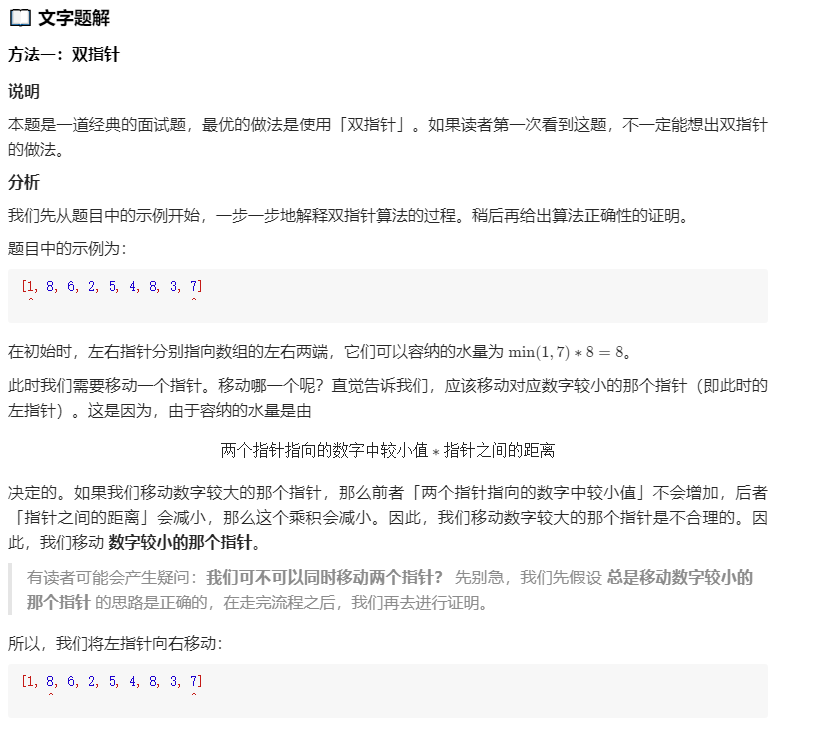
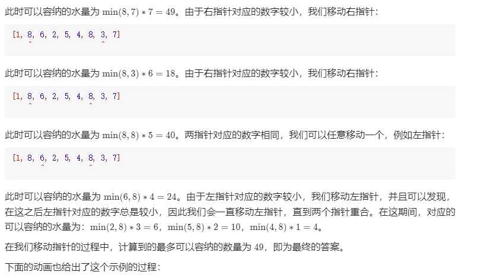
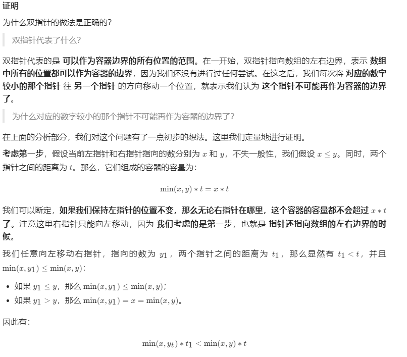
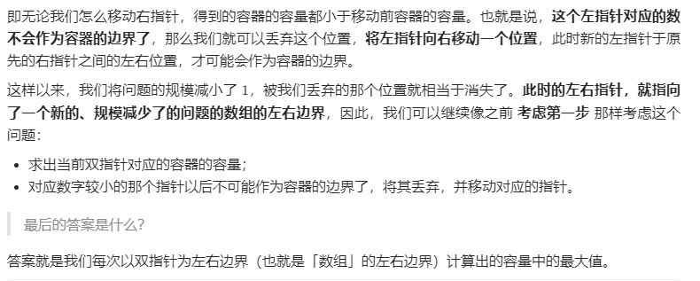

### leetcode_11_medium_盛最多水的容器





```c++
class Solution {
public:
    int maxArea(vector<int>& height) {

    }
};
```

#### 我的思路

没见过原题的话，这题很难做出来。

考虑dp算法，如果dp[i]代表以第i个数作为右边界的话，无法写出状态转移方程。

参考官方题解，以下简略叙述

##### 操作方法

考虑一种朴素的想法。

1. 一开始指定数组的左右边界l=0、r=height.size()-1。计算盛水的体积
2. 收缩左右边界。如果height[l]<=height[r]，则收缩左边界。如果height[r]>height[r]，则收缩右侧边界。
3. 直到边界无法再收缩。返回收缩过程中，最大的盛水的体积

##### 正确性证明

总是存在一组resL、resR，使得[l,r]区间对应最大的盛水的体积。

从l=0，r=height.size()-1开始考虑。

使用**数学归纳法**，当[resL,resR]是[l,r]的子区间时，当前容积**volumn(l,r)**=min(height[l],height[r]) * (l-r)**=height[l] * (l-r)**。

假设height[l] <= height[r]：

如果保持左边界l不变，那么 **无论如何收缩右边界，volumn(l,r)总是小于当前volumn**。所以 ，这个左指针对应的位置，不可能带来更好的体积。所以可以**丢弃该位置**，将**左指针右移**。

**换句话说，如果[l,r]的子区间中有更好的答案，那么这个更好的答案也不会以l为左边界。**

假设height[l]>height[r]：

同理。

```c++
class Solution {
public:
	int maxArea(vector<int>& height) {
		int result = 0, curArea;
		int l = 0, r = height.size() - 1;
		while (l < r)
		{
			if (height[l] <= height[r])
			{
				curArea = height[l] * (r - l);
				l++;
			}
			else
			{
				curArea = height[r] * (r - l);
				r--;
			}
			result = max(result, curArea);
		}
		return result;
	}
};
```


#### 官方题解

官方题解也很清晰易懂，传送门https://leetcode-cn.com/problems/container-with-most-water/solution/sheng-zui-duo-shui-de-rong-qi-by-leetcode-solution/







