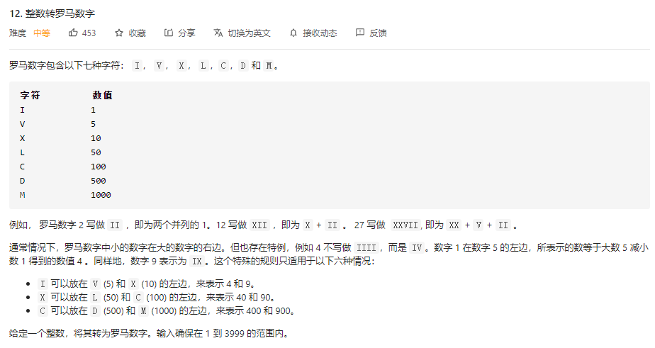
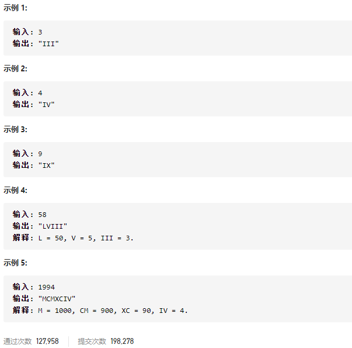

### leetcode_12_medium_整数转罗马数字





```c++
class Solution {
public:
    string intToRoman(int num) {

    }
};
```

#### 查找表法

因为罗马数字是千位/百位/十位/个位，按顺序分别对应字母，所以可以相应的 构造4个查找表。

```c++
class Solution {
public:
	string intToRoman(int num) {
		static vector<string> lutK = { "", "M", "MM", "MMM" };  //千位 查找表
		static vector<string> lutH = { "","C","CC","CCC","CD","D","DC","DCC","DCCC","CM" };  //百位查找表
		static vector<string> lutT = { "","X","XX","XXX","XL","L","LX","LXX","LXXX","XC" };  //十位查找表
		static vector<string> lutD = { "","I","II","III","IV","V","VI","VII","VIII","IX" };  //个位查找表

		string result;
		//千位
		if (num >= 1000)
		{
			result += lutK[num / 1000];
			num = num % 1000;
		}
		//百位
		if (num >= 100)
		{
			result += lutH[num / 100];
			num = num % 100;
		}
		//十位
		if (num >= 10)
		{
			result += lutT[num / 10];
			num = num % 10;
		}
		result += lutD[num];
		return result;
	}
};
```

#### 贪心算法

和硬编码方法差别不大。

为每一种字符组合编码，包括9、90、900代表的数。

计算时，总是尽可能的先使用大数代表的字符编码

java答案

```java
int[] values = {1000, 900, 500, 400, 100, 90, 50, 40, 10, 9, 5, 4, 1};    
String[] symbols = {"M","CM","D","CD","C","XC","L","XL","X","IX","V","IV","I"};

public String intToRoman(int num) {
    StringBuilder sb = new StringBuilder();
    // Loop through each symbol, stopping if num becomes 0.
    for (int i = 0; i < values.length && num >= 0; i++) {
        // Repeat while the current symbol still fits into num.
        while (values[i] <= num) {
            num -= values[i];
            sb.append(symbols[i]);
        }
    }
    return sb.toString();
}
```

