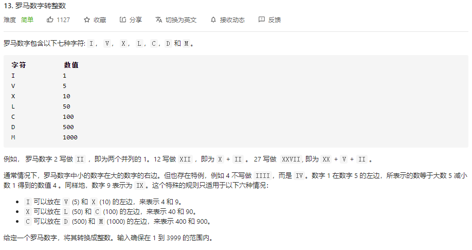
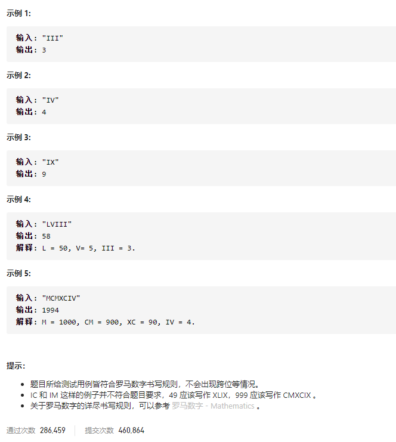

### leetcode_13_easy_罗马数字转整数





```c++
class Solution {
public:
    int romanToInt(string s) {

    }
};
```


罗马数字转整数，可以看做是每单个/两个罗马字符转整数，之后再把这些数相加的结果。

问题在于如何判断，何时把两个罗马字符视作一个整体？当后一个罗马字符代表的数>前一个罗马字符代表的数，即认为他们代表一个整体。

```c++
class Solution {
public:
	int romanToInt(string s) {
		static unordered_map<char, int> symbolMap = { {'I',1},{'V',5},{'X',10},{'L',50},{'C',100},{'D',500},{'M',1000} };

		int result = 0, i = 0;
		while (i < s.size() - 1)
		{
			if (symbolMap[s[i + 1]] > symbolMap[s[i]])  //当前字符与下一字符形成组合 代表一个数
			{
				result += symbolMap[s[i + 1]] - symbolMap[s[i]];
				i += 2;
			}
			else  //当前字符代表一个数
			{
				result += symbolMap[s[i]];
				i++;
			}
		}
		if (i < s.size())
			result += symbolMap[s[i]];
		return result;
	}
};
```


#### 效率提升

另外 寻找罗马字符到数的映射，使用switch语句比unordered_map快很多。

```c++
class Solution {
public:
	int symbolMap(char c)
	{
		switch (c)
		{
		case 'I':return 1;
		case 'V':return 5;
		case 'X':return 10;
		case 'L':return 50;
		case 'C':return 100;
		case 'D':return 500;
		case 'M':return 1000;
		default:return 0;
		}
	}
	int romanToInt(string s) {
		//static unordered_map<char, int> symbolMap = { {'I',1},{'V',5},{'X',10},{'L',50},{'C',100},{'D',500},{'M',1000} };

		int result = 0, i = 0;
		while (i < s.size() - 1)
		{
			if (symbolMap(s[i + 1]) > symbolMap(s[i]))  //当前字符与下一字符形成组合 代表一个数
			{
				result += symbolMap(s[i + 1]) - symbolMap(s[i]);
				i += 2;
			}
			else  //当前字符代表一个数
			{
				result += symbolMap(s[i]);
				i++;
			}
		}
		if (i < s.size())
			result += symbolMap(s[i]);
		return result;
	}
};
```

