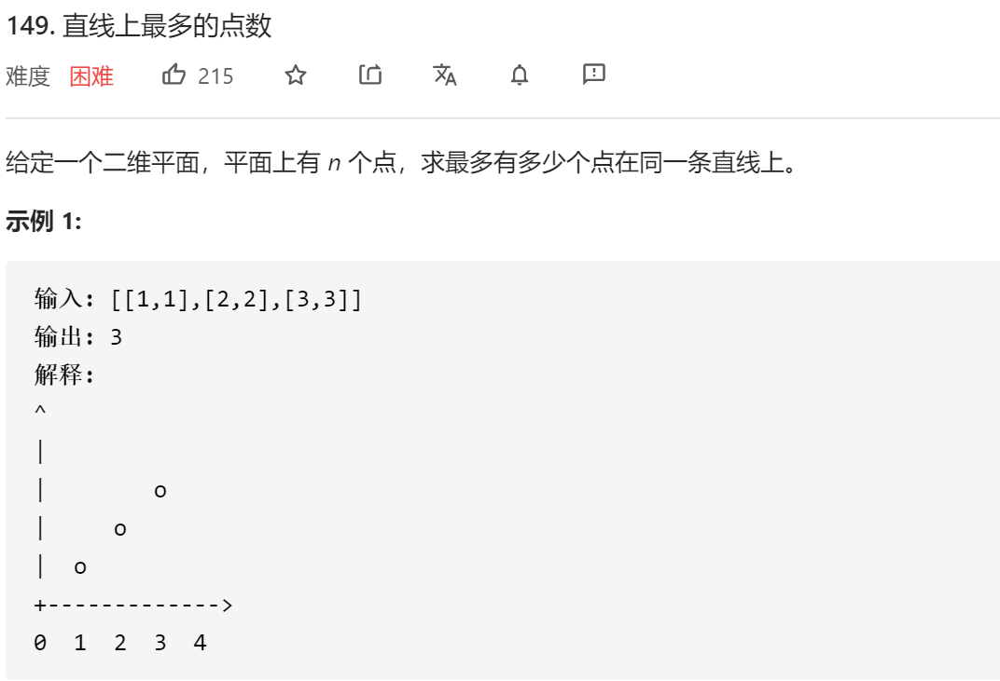

### leetcode_149_hard_直线上最多的点数




```c++
class Solution {
public:
    int maxPoints(vector<vector<int>>& points) {

    }
};
```

#### 算法思路

##### 总体思路

分析 三点共线的条件，即两两连线，斜率相等。

对于每一个点i，寻找它最多与其余几个点共线。那么 对于余下的每个点j，按照他与点i的斜率 进行分组，累加到hash_map中。


例如，讨论i=0，j属于[1,5]时。即为讨论点1、2、3、4、5分别与点0连线。以斜率为key 存储在不同的hash_map中。则，线段0-1、线段0-2 斜率相同，累加到hash_map的同一处。最终能得到的最长线段长度为3

当讨论第i个点时，其实需要讨论的j的取值范围为，j>i。因为对于小于i的某点k，i-k的连线已经在之前讨论过了。

##### 斜率的处理

上述讨论的理想情况，是以斜率作为hash_map的key。但是，float 型的斜率 在计算时可能会有误差。如下图


所以，当讨论两点之间的斜率时，考虑以{dx,dy}这样的二元组来记录。其中，dx、dy互质。又有几种特殊情况

- 两点y相同。令dx=1,dy=0
- 两点x相同。令dx=0,dy=1
- dx,dy同号。则dx>0,dy>0
- dx,dy异号。令dx>0,dy<0

##### 最大公约数

讨论简单情形，对于正整数dx、dy，求他们的最大公约数。可用辗转相除法


以下方法有错

```c++
class Solution {
public:
	int maxPoints(vector<vector<int>>& points) {
		int i, j, result;
		pair<int, int> slopePair;  //表示斜率的二元组
		unordered_map<pair<int, int>, int> slopeCount;  //和当前点，各种斜率的点的数量

		result = 0;
		for (i = 0; i < points.size(); i++)
		{
			slopeCount.clear();
			for (j = i + 1; j < points.size(); j++)
			{
				slopePair = solveSlope(points[i], points[j]);
				slopeCount[slopePair]++;
				result = max(result, slopeCount[slopePair]);
			}
		}
		return result + 1;
	}

	//用一个互质的二元组{dx,dy} 表示两点间的斜率
	pair<int, int> solveSlope(vector<int> pt1, vector<int> pt2)
	{
		bool negative;  //指示是否要把dy变为负值
		int dx, dy,factor;

		dx = pt2[0] - pt1[0];
		dy = pt2[1] - pt1[1];
		if (dx == 0)
			return make_pair(0, 1);
		if (dy == 0)
			return make_pair(1, 0);
		//讨论符号
		negative = false;
		if (dx < 0)
		{
			negative = -negative;
			dx = -dx;
		}
		if (dy < 0)
		{
			negative = -negative;
			dy = -dy;
		}
		//辗转相除法 求最大公因式
		while (true)
		{
			if (dx < dy)
				swap(dx, dy);
			if (dy%dx == 0)
			{
				factor = dx;
				break;
			}
			else
			{
				dx = dy;
				dy = factor;
			}
		}
		//令dx,dy互质
		dx = (pt2[0] - pt1[0])/factor;
		dy = (pt2[1] - pt1[1])/factor;
		if (negative)
			dy = -dy;
		return make_pair(dx,dy);
	}
};
```


因为unordered_map不能以pair<>为key。

此外 上述代码还有其他逻辑错误。

##### 斜率的处理Ⅱ

因此  仍然使用float作为斜率，不过 考虑上述优化。

转而使用字符串分子/分母 作为key

注意测试用例

```
[[0,0],[1,1],[0,0]]
```

```
[[0,0]]
```

```
[[1,1],[1,1],[0,0],[3,4],[4,5],[5,6],[7,8],[8,9]]
```

```
[[0,0],[94911150,94911151],[94911151,94911152]]
```

```c++
class Solution {
public:
	int maxPoints(vector<vector<int>>& points) {
		int i, j, numSamePt, sameSlopeMax,dx,dy,positive,factor,result;
		string curKey;
		unordered_map<string, int> slopeCount;

		sort(points.begin(), points.end());
		result = 0;
		for (i = 0; i < points.size(); i++)
		{
			numSamePt = 0;  //与points[i]重复的点的数量(包括points[i]本身)
			sameSlopeMax = 0;  //hashmap的最大值
			slopeCount.clear();
			for (j = i; j < points.size(); j++)
			{
				if (points[i] == points[j])
				{
					numSamePt++;
					continue;
				}
				//计算斜率
				dx = points[j][1] - points[i][1];
				dy = points[j][0] - points[i][0];
				dy = dy < 0 ? -dy : dy;
				positive = dy < 0 ? -1 : 1;
				factor = gcd(dx, dy);
				dx = dx / factor;
				dy = dy / factor * positive;
				//以斜率为key 进行存储
				curKey = to_string(dx) + "@" + to_string(dy);
				slopeCount[curKey]++;
				sameSlopeMax = max(sameSlopeMax, slopeCount[curKey]);
			}
			result = max(result, sameSlopeMax + numSamePt);
		}
		return result;
	}

	//求两个数的最大公约数
	//0与任何数的最大公约数 规定为那个数本身
	int gcd(int a, int b)
	{
		int temp;
		while (b!=0)
		{
			temp = a % b;
			a = b;
			b = temp;
		}
		return a;
	}
};
```

