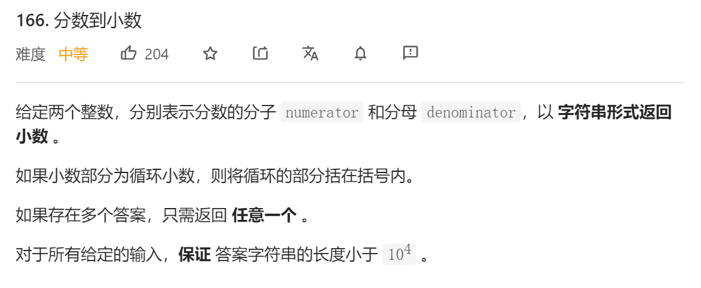
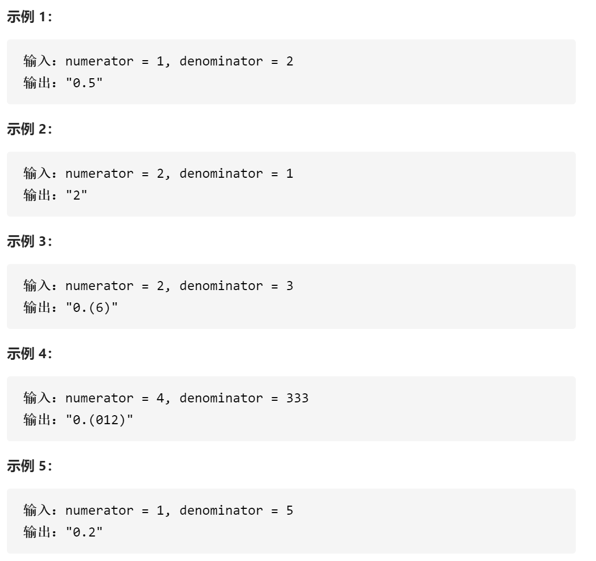
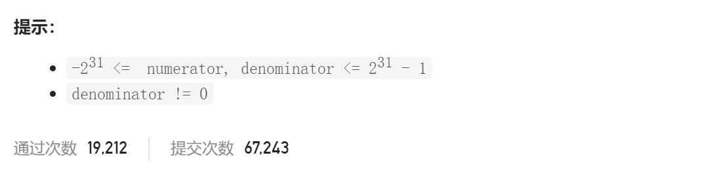

### leetcode_166_medium_分数到小数







```c++
class Solution {
public:
    string fractionToDecimal(int numerator, int denominator) {

    }
};
```

#### 算法思路

模拟长除法(竖式除法)

关于如何判别循环小数，核心思想是，**当商出现重复的时候，长除法中的余数也会重复出现**

```c++
class Solution {
public:
	string fractionToDecimal(int numerator, int denominator) {
		int pos;
		unordered_map<long long, int> fracPos;  //记录余数上一次出现的位置
		long long num = (long long)numerator;
		long long denom = (long long)denominator;
		long long frac;
		string result="";

		//符号处理
		if (num == 0)
			return "0";
		if ((num < 0) ^ (denom < 0))
			result += '-';
		if (num < 0)
			num = -num;
		if (denom < 0)
			denom = -denom;
		//整数部分
		frac = num / denom;
		num = num % denom;
		result += to_string(frac);
		if (num == 0)
			return result;
		//小数部分(长除法)
		result += '.';
		pos = 1;
		while (num > 0)
		{
			num *= 10;
			if (fracPos.find(num) == fracPos.end())  //如果这个余数第一次出现，则记录它的位置
				fracPos[num] = pos;
			else  //如果这个余数不是第一次出现，则找到了循环小数
				break;
			result += to_string(num / denom);
			num = num % denom;
			pos++;
		}
		//处理循环小数
		if (num > 0)  //上层循环跳出时 num>0，意味着找到了循环小数
		{
			result.insert(result.size() - (pos - fracPos[num]), "(");
			result += ")";
		}
		return result;
	}
};
```

