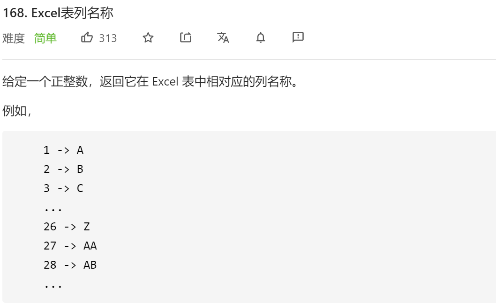
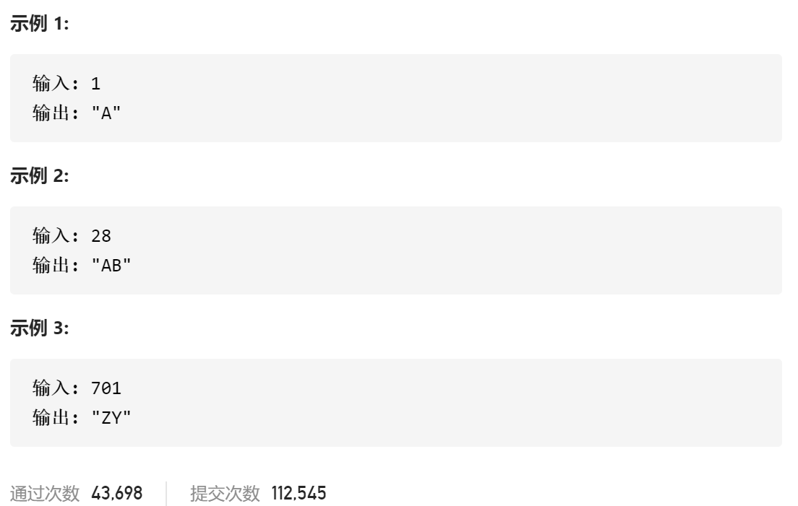

### leetcode_168_easy_Excel表列名称





#### 算法思路

相当于进制转换，10进制转26进制。不过，26进制中没有表示0的字符。处理这个问题的核心思想在于，如果算出来当前位digit=0，则从高位**“借1”**

```c++
class Solution {
public:
	string convertToTitle(int n) {
		int digit;  //当前位的数值
		string result = "";
		while (n != 0)
		{
			digit = n % 26;
			n = n / 26;
			if (digit == 0)  //控制不能出现0
			{
				n--;  //从高位借1
				digit = 26;
			}
			result = char(digit + 'A' - 1) + result;
		}
		return result;
	}
};
```

