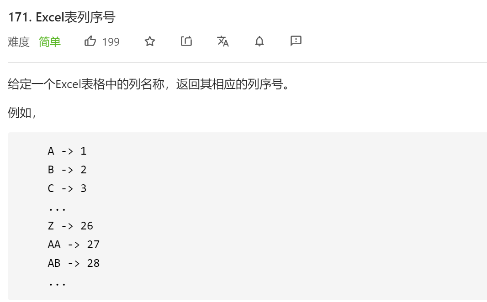
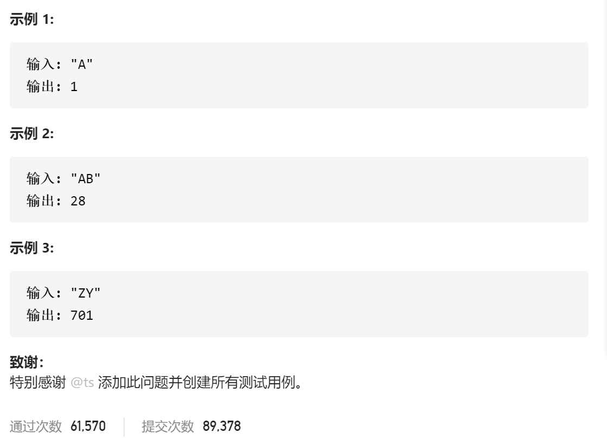

### leetcode_171_easy_Excel表列序号





```c++
class Solution {
public:
    int titleToNumber(string s) {

    }
};
```

#### 算法思路

类似 26进制转10进制。有微小的不同

```c++
class Solution {
public:
	int titleToNumber(string s) {
		int result = 0,i;

		for (i = 0; i < s.size(); i++)
		{
			result *= 26;
			result += s[i] - 'A' + 1;
		}
		return result;
	}
};
```

