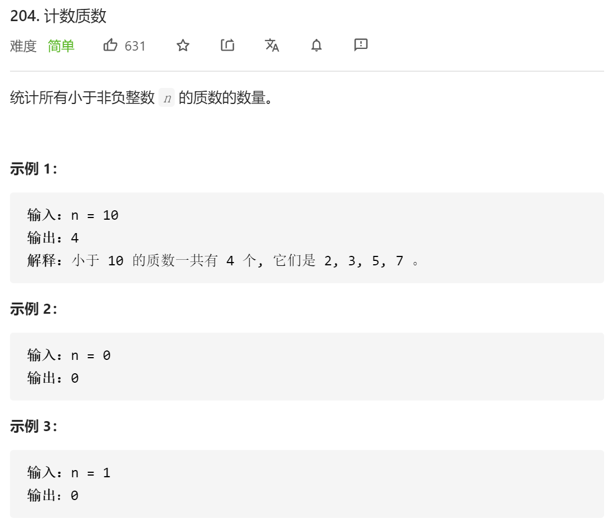
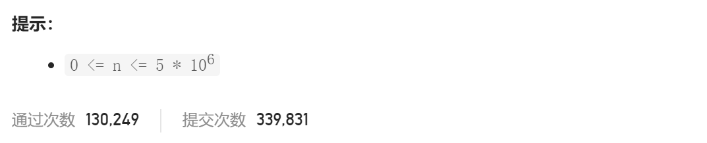
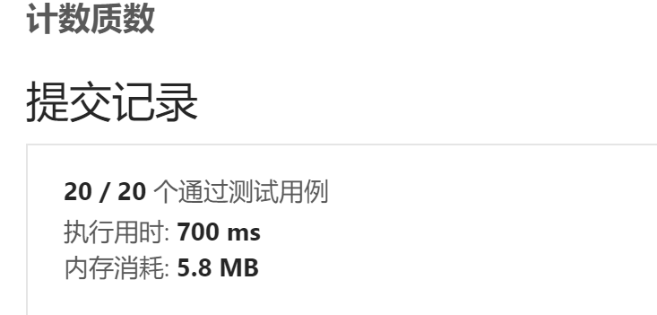
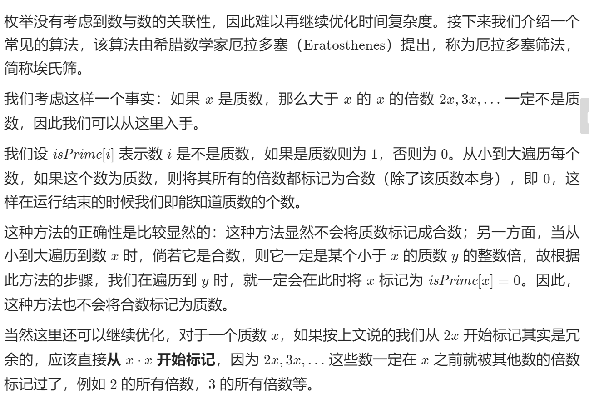

### leetcode_204_easy_计数质数.md





```c++
class Solution {
public:
    int countPrimes(int n) {

    }
};
```

#### 枚举法1

判断k是否为质数，即判断能否被[2,√k]整除。

```c++
class Solution {
public:
	int countPrimes(int n) {
		int i,result = 0;

		for (i = 2; i < n; i++)
		{
			if (isPrime(i))
				result++;
		}
		return result;
	}

	bool isPrime(int n)
	{
		int i;
		
		for (i = 2; i*i <= n; i++)
		{
			if (n%i == 0)
				return false;
		}
		return true;
	}
};
```



#### 枚举法2

与上面的唯一区别在于，使用了sqrt()

```c++
class Solution {
public:
	int countPrimes(int n) {
		int i,result = 0;

		for (i = 2; i < n; i++)
		{
			if (isPrime(i))
				result++;
		}
		return result;
	}

	bool isPrime(int n)
	{
		int i;
		
		for (i = 2; i <= sqrt(n); i++)
		{
			if (n%i == 0)
				return false;
		}
		return true;
	}
};
```


#### 埃氏筛



```c++
class Solution {
public:
	int countPrimes(int n) {
		int i, j, result = 0;
		vector<bool> isPrime(n, true);  //数字k是否为质数

		for (i = 2; i < n; i++)
		{
			if (isPrime[i])
				result++;
			if ((long long)i*i > n)
				continue;
			for (j = i * i; j < n; j += i)  //将i的所有倍数记为合数
			{
				isPrime[j] = false;
			}
		}
		return result;
	}
};
```

