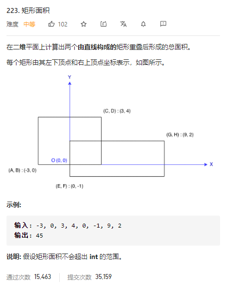

### leetcode_223_medium_矩形面积



```c++
class Solution {
public:
    int computeArea(int A, int B, int C, int D, int E, int F, int G, int H) {

    }
};
```

####  算法思路

这样理解。一个矩形 左下顶点(x1,y1)，右上顶点(x2,y2)。这等价于 规定x>=x1,y>=y1,x<=x2,y<=y2的部分是矩形区域。

两个矩形的重合面积，即计算同时满足这两个矩形约束条件的区域大小

重叠后的总面积，即两个矩形的面积和-重合部分面积

```c++
class Solution {
public:
	int computeArea(int A, int B, int C, int D, int E, int F, int G, int H) {
		long x1, x2, y1, y2, width, height;

		x1 = max(A, E);
		x2 = min(C, G);
		y1 = max(B, F);
		y2 = min(D, H);
		width = x1 < x2 ? x2 - x1 : 0;
		height = y1 < y2 ? y2 - y1 : 0;
		return (long)(C - A)*(D - B) + (long)(G - E)*(H - F) - width * height;
	}
};
```

