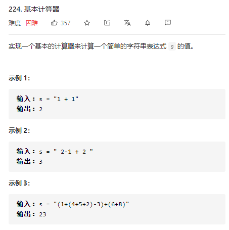

### leetcode_224_hard_基本计算器




#### 朴素的思路

数学表达式计算，自然地想到用堆栈处理。


分为数字栈和符号栈。每当读取到数字的时候，总尝试另外取出一个符号与数字，进行运算。

每当产生了新的数字 包括从括号中释放出来的数字，都要进行计算。

- 如果读取到数字，尝试进行运算
  - 如果符号栈顶运算符为'+'、'-'，则分别弹栈进行运算，结果入数字栈
  - 如果符号栈顶运算符为'('，则在括号内，不应进行运算
- 如果读取到运算符
  - 如果该元素为')'，则对应括号内元素应该已经处理完，符号栈弹栈'('。进行运算
  - 其他情况，将符号入栈

```c++
class Solution {
public:
	int calculate(string s) {
		int l, r, curNum;
		stack<int> nums;  //数字栈
		stack<char> oper;  //符号栈

		for (l = 0; l < s.size(); l++)
		{
			if (s[l] == ' ')  //空字符
				continue;
			else if ('0' <= s[l] && s[l] <= '9')  //数字
			{
				r = l;
				while (r<=s.size() && '0' <= s[r] && s[r] <= '9')
					r++;
				curNum = stoi(s.substr(l, r - l));  //当前数字
				l = r - 1;
				nums.push(curNum);
				calculate(nums, oper);  //新数字加入 尝试进行运算
			}
			else  //运算符
			{
				if (s[l] == ')')  //当找到了一个右括号，肯定有左括号与之对应，且括号内的式子已经计算完毕
				{
					oper.pop();
					calculate(nums, oper);  //新数字加入 尝试进行运算
				}
				else
					oper.push(s[l]);
			}
		}
		return nums.top();
	}

	//对于给定的数字栈、符号栈，进行尽可能多的运算 从而简化堆栈
	void calculate(stack<int> &nums, stack<char> &oper)
	{
		int num1, num2;
		while (!oper.empty() && (oper.top() == '+' || oper.top()=='-'))
		{
			num2 = nums.top();
			nums.pop();
			num1 = nums.top();
			nums.pop();
			nums.push(oper.top() == '+' ? num1 + num2 : num1 - num2);
			oper.pop();
		}
	}
};
```

```
//阴间样例
"-2+ 1"
"-1-(-1)"
```


#### 改进版本

考虑对于任意一个不含括号的字符串表达式s，其最前端有可能多出一个符号'-'。因此 在计算时，视作该'-'另有一个运算数0。此算法在calculate()函数中体现

为了把问题简化为求解不含括号的字符串，因此抽象出一个函数partSum()，用于计算子串的值。对于括号内的部分  用partSum()求解。

 

```c++
class Solution {
public:
	int calculate(string s) {
		int index = 0;

		return partSum(s, index);
	}

	//对于s的一个合法子字符串进行运算，直到寻找到多出的右括号，或者访问到s的末尾
	//index为子串起始字符。运算结束时，index指向')'或者s.size()
	int partSum(const string &s, int &index)
	{
		int r, curNum;
		stack<int> nums;  //数字栈
		stack<char> oper;  //符号栈

		for (; index < s.size()&&s[index]!=')'; index++)
		{
			if (s[index] == ' ')  //空字符
				continue;
			else if ('0' <= s[index] && s[index] <= '9')  //数字
			{
				r = index;
				while (r <= s.size() && '0' <= s[r] && s[r] <= '9')
					r++;
				curNum = stoi(s.substr(index, r - index));  //当前数字
				index = r - 1;
				nums.push(curNum);
				calculate(nums, oper);  //新数字加入 尝试进行运算
			}
			else  //运算符
			{
				if (s[index] == '(')  //当找到一个左括号 则调用函数对这组括号内的子串进行计算
				{
					nums.push(partSum(s, ++index));  //计算子串(右括号会随着for循环中的l++ 自动跳过)
					calculate(nums, oper);  //新数字加入 尝试进行运算
				}
				else
					oper.push(s[index]);
			}
		}
		return nums.top();
	}

	//对于给定的数字栈、符号栈，进行尽可能多的运算 从而简化堆栈
	void calculate(stack<int> &nums, stack<char> &oper)
	{
		int num1, num2;
		while (!oper.empty())  //堆栈中只有可能是'-'或者'+'
		{
			num2 = nums.top();
			nums.pop();
			if (!nums.empty())
			{
				num1 = nums.top();
				nums.pop();
			}
			else
				num1 = 0;
			nums.push(oper.top() == '+' ? num1 + num2 : num1 - num2);
			oper.pop();
		}
	}
};
```