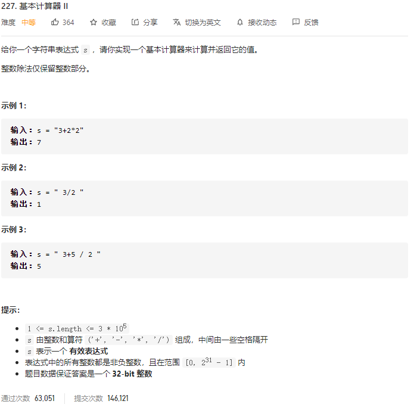

### leetcode_227_medium_基本计算器 Ⅱ



```c++
class Solution {
public:
    int calculate(string s) {

    }
};
```

#### 算法思路

分别使用数据栈，符号栈

第一趟扫描，处理乘除

第二趟，处理加减

```c++
class Solution {
public:
	int calculate(string s) {
		int l, r;
		int num1, num2, result;
		stack<int> nums;  //数据栈
		stack<char> operators;  //符号栈

		//第一趟扫描 处理乘除
		l = 0;
		while (l < s.size())
		{
			if (s[l] == ' ')
				++l;
			else if (s[l] == '+' || s[l] == '-' || s[l] == '*' || s[l] == '/')
			{
				operators.push(s[l]);
				++l;
			}
			else  //处理数
			{
				//读入数据
				r = l + 1;  //[l,r)为数据下标范围 左闭右开区间
				while (r < s.size() && s[r] >= '0'&&s[r] <= '9')
					++r;
				nums.push(stoi(s.substr(l, r - l)));
				l = r;
				//如有需要 计算数据
				if (!operators.empty() && (operators.top() == '*' || operators.top() == '/'))
				{
					num2 = nums.top();
					nums.pop();
					num1 = nums.top();
					nums.pop();
					nums.push(operators.top() == '*' ? num1 * num2 : num1 / num2);
					operators.pop();
				}
			}
		}
		//第二趟 处理加减
		result = 0;
		while (!operators.empty())
		{
			result += operators.top() == '+' ? nums.top() : -nums.top();
			operators.pop();
			nums.pop();
		}
		return result + nums.top();
	}
};
```

