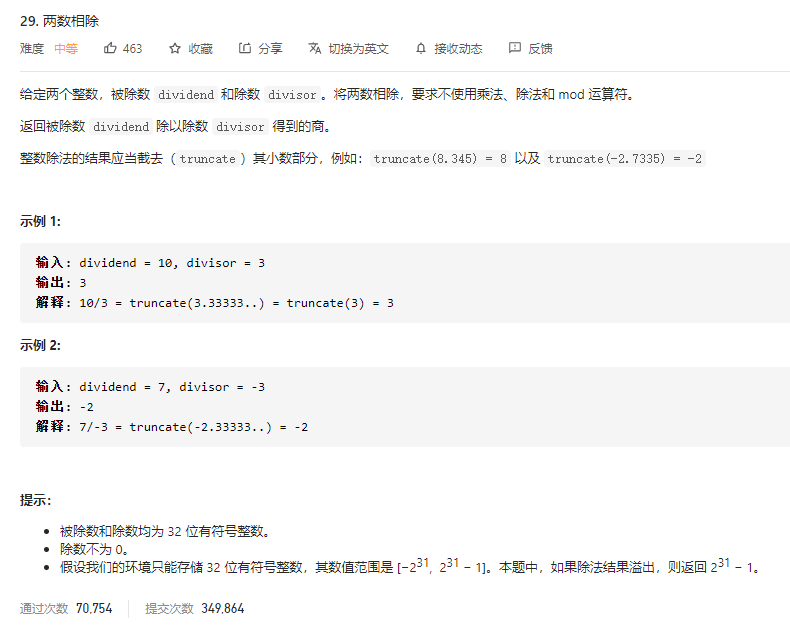

### leetcode_29_medium_两数相除



```c++
class Solution {
public:
    int divide(int dividend, int divisor) {

    }
};
```

#### 算法思路

##### 递归求解

不允许乘除操作，但是允许移位操作，左移一位也相当于与自身相加。那么，对于被除数dividend，将除数divisor不断左移，直到divisor刚好<=dividend，则找到了部分积。然后可以将问题变为 递归地求dividend减去部分积，与divisor除的商。

举个例子：11除以3，11>3。让3翻倍得到6，11>6仍然没问题。6翻倍得到12，11<12有问题了。那么久知道只能11-6=5，部分商=2，然后去求5除以3的商。

将这个递归求解的方法，封装为一个函数myDivide()。暂不讨论边界情况的问题

##### 边界情况

方便起见，myDivide()仅用于处理两个非负数相除的问题。所以需要把除数，被除数 都转变为正数。涉及几种边界情况。

- 除数divisor==INT_MIN，所以不能直接取反。
  - 如果dividend==INT_MIN，则结果为1
  - 其他情况，结果为0
- 被除数dividend==INT_MIN，所以不能直接取反。
  - 如果divisor==-1，则会导致商溢出。按照题目要求，return INT_MAX即可
  - 其他的divisor<0的情况，将-(dividend-divisor)作为被除数，放入myDivide函数，从而避免相反数越界
  - 当divisor>0时，将-(dividend+divisor)作为被除数，放入myDivide函数，从而避免相反数越界
  - 注意，因为可能涉及divisor==INT_MIN的情况，这种情况下dividend-divisor会报错。所以，要先进行除数divisor的判断，再进行本步骤dividend的判断
- myDivide()函数中，部分乘积 product左移的操作，可能涉及越界问题。因此，建立static int PRODUCT_MAX = INT_MAX / 2; 当乘积product<=这个值的时候  才允许进行左移操作

```c++
class Solution {
public:
	int divide(int dividend, int divisor) {
		int result;
		//处理divisor引起的越界问题
		if (divisor == INT_MIN)
		{
			if (dividend == INT_MIN)
				return 1;
			else
				return 0;
		}
		//处理dividend引起的越界问题
		if (dividend == INT_MIN)
		{
			if (divisor == -1)  //仅有这一种情况会导致商溢出
				return INT_MAX;
			else  //其他情况，需要解决的问题是-divident>INT_MAX
			{
				if (divisor < 0)
					return myDivide(-(dividend - divisor), -divisor) + 1;
				else
					return -(myDivide(-(dividend + divisor), divisor)) - 1;
			}
		}
		//一般情况下，将两个数处理为正数，送入
		bool positive = true;
		if (dividend < 0)
		{
			positive = !positive;
			dividend = -dividend;
		}
		if (divisor < 0)
		{
			positive = !positive;
			divisor = -divisor;
		}
		result = myDivide(dividend, divisor);
		if (!positive)
			result = -result;
		return result;
	}

	int myDivide(int dividend, int divisor)  //对两个正数求商,限制除数[0,INT_MAX/2]，被除数[0,INT_MAX]
	{
		static int PRODUCT_MAX = INT_MAX / 2;  //当乘积product<=这个值的时候  允许进行左移操作
		int product;  //暂存商和除数的乘积
		int quotient;  //部分商的值
		if (dividend < divisor)
			return 0;
		product = divisor;
		quotient = 1;
		while (product<=PRODUCT_MAX && product<<1 <= dividend)  //直到product不符合要求为止
		{
			product=product << 1;
			quotient=quotient << 1;
		}
		return quotient + myDivide(dividend - product, divisor);
	}
};
```

