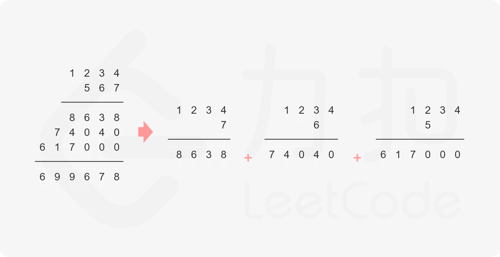

### leetcode_43_medium_字符串相乘


```c++
class Solution {
public:
    string multiply(string num1, string num2) {

    }
};
```

#### 算法思路

手动实现小学**竖式计算乘法**。

当然可以严格地按照竖式的做法，用num2的每一位数字，与num1的数相叠加。然后将这些成绩再累加起来



但是，也可以考虑另一种思路。num1与num2相乘，也即num1的每一位数字a，与num2的每一位数字b相乘（考虑数字所在的位置 个位、十位、百位等）。根据a、b所在的位置，规定a*b所得的数放在结果数组的哪个位置。

考虑用一个size1+size2大小的int数组result，存储结果。易证，num1*num2的结果位数为size1+size2或者size1+size2-1。以result[0]为最高位，result[size1-size2+1]为最低位。那么，nums[i]=a，与nums[j]=b，其成绩应该暂存在result[i+j+1]处。

1. num1的各个数字 与 num2的各个数字相乘，结果暂存在result数组中
2. result从低位向高位，将超过10的元素进位
3. 将result数组转回字符串

```c++
class Solution {
public:
	string multiply(string num1, string num2) {
		int i, j, a, b, size1 = num1.size(), size2 = num2.size();
		vector<int> result(size1 + size2, 0);  //result[0]为最高位，result[size1+size2-1]为最低位
		string strResult;

		if (num1 == "0" || num2 == "0")
			return "0";
		//计算各个位置的数，暂存在result数组中
		for (i = 0; i < size1; i++)
		{
			for (j = 0; j < size2; j++)
			{
				a = num1[i] - '0';
				b = num2[j] - '0';
				result[i + j + 1] += a * b;
			}
		}
		//处理进位
		for (i = size1 + size2 - 1; i >= 1; i--)
		{
			result[i - 1] += result[i] / 10;
			result[i] = result[i] % 10;
		}
		//数组转回字符串
		i = (result[0] == 0 ? 1 : 0);
		strResult = "";
		for (; i < size1 + size2; i++)
		{
			strResult += result[i] + '0';
		}

		return strResult;
	}
};
```

