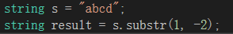

### leetcode_65_hard_有效数字


```c++
class Solution {
public:
    bool isNumber(string s) {

    }
};
```

#### 算法思路

**辣鸡题目 建议放弃**

##### 十进制数的要求

总结字符串解释为十进制数字需要满足的几条规律：

- 字符串开头和结尾可以有若干空格，中间不能有空格。对于无空格的字符串
  - 不能有字符列表以外的字符
  - 最多有一个'e'。'e'前方需要有数，'e'后方需要有整数。对于不含'e'的字符串
    - 前面可以有至多1个'+'或者'-'
    - 小数点'.'前需有数，'.'后需有整数

##### 算法步骤

因此，对于字符串，判断它是否表示有效数字，可以按照如下步骤

1. 滤掉所有空格' '
2. 判断是否含有字符'e'
   - 如果含有'e'
     1. 判断e前面是否为小数或整数
     2. 判断e后面是否为整数
   - 如果不含'e'，判断是否为小数或整数

##### 辅助函数

承接算法步骤，需要另外两个辅助函数

- bool isInteger(string s)；  //对于一个不含' ',不含'e'的字符串，判断是否表示整数
- bool isDecimal(string s)；  //对于一个不含' ',不含'e'的字符串，判断是否表示整数或小数

##### substr()注意点

s.substr(pos,n)需满足

- pos的位置需合法，0<=pos<=s.size()，否则会抛出异常

  

- 长度n不能为负值，需满足n>=0，否则会取到不合理的子字符串

  


##### 测试用例与提交结果

本题没有提交通过。关于“有效数字”的标准，我的理解、其他用户的理解、官方理解 并不统一。

参考第三方题解[详细通俗的思路分析，多解法 - 有效数字 - 力扣（LeetCode） (leetcode-cn.com)](https://leetcode-cn.com/problems/valid-number/solution/xiang-xi-tong-su-de-si-lu-fen-xi-duo-jie-fa-by-1-4/)

测试用例如下

```c++
test(1, "123", true);
test(2, " 123 ", true);
test(3, "0", true);
test(4, "0123", true);  //Cannot agree
test(5, "00", true);  //Cannot agree
test(6, "-10", true);
test(7, "-0", true);
test(8, "123.5", true);
test(9, "123.000000", true);
test(10, "-500.777", true);
test(11, "0.0000001", true);
test(12, "0.00000", true);
test(13, "0.", true);  //Cannot be more disagree!!!
test(14, "00.5", true);  //Strongly cannot agree
test(15, "123e1", true);
test(16, "1.23e10", true);
test(17, "0.5e-10", true);
test(18, "1.0e4.5", false);
test(19, "0.5e04", true);
test(20, "12 3", false);
test(21, "1a3", false);
test(22, "", false);
test(23, "     ", false);
test(24, null, false);
test(25, ".1", true); //Ok, if you say so
test(26, ".", false);
test(27, "2e0", true);  //Really?!
test(28, "+.8", true);  
test(29, " 005047e+6", true);  //Damn = =|||
```

我的提交情况


我的代码

```c++
class Solution {
public:
	bool isNumber(string s) {
		int i, j;
		//滤掉空格
		i = 0;
		while (i < s.size() && s[i] == ' ')
			i++;
		j = s.size() - 1;
		while (j >= 0 && s[j] == ' ')
			j--;
		s = s.substr(min(int(s.size()), i), max(0, j - i + 1));
		//根据是否含e进行讨论
		for (i = 0; i < s.size(); i++)
		{
			if (s[i] == 'e')
				return isDecimal(s.substr(0, max(0, i))) && isInteger(s.substr(i + 1));
		}
		return isDecimal(s);
	}

	//对于一个不含' ',不含'e'的字符串，判断是否表示整数
	bool isInteger(string s)
	{
		int i;
		if (s.empty())  //空字符串不能被解析为整数
			return false;
		for (i = 0; i < s.size(); i++)  //跳过前面的正负号
			if ((s[i] != '+') && (s[i] != '-'))
				break;
		if (i > 1)  //如果找到了至少2个正负号
			return false;
		for (; i < s.size(); i++)
		{
			if (s[i]<'0' || s[i]>'9')
				return false;
		}
		return true;
	}

	//对于一个不含' ',不含'e'的字符串，判断是否表示整数或小数
	bool isDecimal(string s)
	{
		int i;
		for (i = 0; i < s.size(); i++)
		{
			if (s[i] == '.')  //作为判断该数是否为小数
			{
				return isInteger(s.substr(0, max(0, i))) && isInteger(s.substr(i + 1));  //小数点的前后要都是整数 才合法
			}
		}
		return isInteger(s);  //没找到小数点，则将该数作为整数处理
	}
};
```

