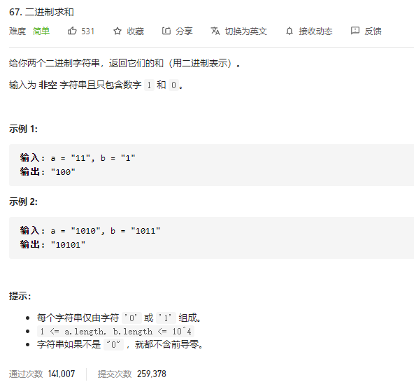

### leetcode_67_easy_二进制求和



```c++
class Solution {
public:
    string addBinary(string a, string b) {

    }
};
```

#### 算法思路

从低位到高位，按位相加即可。用carry存储进位

为了方便计算，可以使用**reverse()**函数。reverse(a.begin(),a.end())，翻转容器