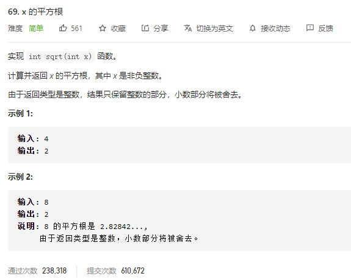
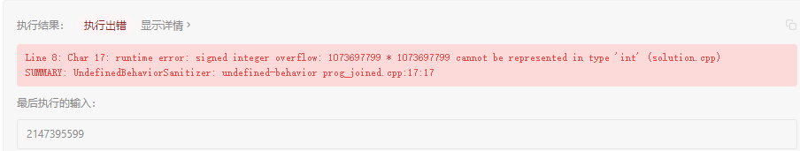

### leetcode_69_easy_x的平方根



```c++
class Solution {
public:
    int mySqrt(int x) {

    }
};
```

#### 二分查找法

二分查找一个result,满足result^2<=x，且(result+1)^2>x。

注意二分查找的分支判断条件

```c++
class Solution {
public:
	int mySqrt(int x) {
		int l = 0, r = x, mid, squre1,squre2;
		while (l <= r)
		{
			mid = (l + r) / 2;
			squre1 = mid * mid;
			squre2 = (mid + 1)*(mid + 1);
			if (squre1 > x)
				r = mid - 1;
			else if (squre2 <= x)
				l = mid + 1;
			else
				return mid;
		}
		return -1;
	}
};
```



**错误原因：未考虑平方运算的上溢**

##### 解决int上溢

对于上述的，int相乘上溢的问题，可以使用long long 来暂存平方数。

注意，下述形式仍然会引起上溢

```c++
int a = INT_MAX;
long long squre = a * a;
```


因为，首先是int型的a*a进行运算，得出的运算结果已经超过了int型的上界。然后才将这个int型的结果，通过赋值运算，强转为long long型的数据。

正确的写法为

```c++
int a = INT_MAX;
long long squre = (long long)a * a;
```


先强转，再赋值


```c++
class Solution {
public:
	int mySqrt(int x) {
		int l = 0, r = x, mid;
		long long squre1, squre2;
		while (l <= r)
		{
			mid = (l + r) / 2;
			squre1 = (long long)mid * mid;
			squre2 = (long long)(mid + 1)*(mid + 1);
			if (squre1 > x)
				r = mid - 1;
			else if (squre2 <= x)
				l = mid + 1;
			else
				return mid;
		}
		return -1;
	}
};
```

