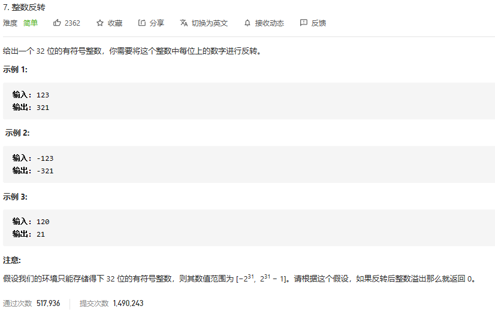

### leetcode_7_medium_整数反转



```c++
class Solution {
public:
    int reverse(int x) {

    }
};
```

题目不难 但是注意有几个坑点

- INT_MIN，取负后 值不变（具体可以探讨补码的机制）。因此需要对其特殊讨论。
- 避免数字*10后上溢，因此用result**>=**INT_MAX来判断溢出

```c++
class Solution {
public:
	int reverse(int x) {
		bool negative=false;
		int limit = INT_MAX / 10,result;
		vector<int> nums;

		//处理INT_MIN
		if (x == INT_MIN)  //INT_MIN=-2147483648，翻转则溢出
			return 0;
		if (x < 0)
		{
			negative = true;
			x = -x;
		}
		//读取每一位数字
		while (x > 0)
		{
			nums.push_back(x % 10);
			x /= 10;
		}
		//提取每一位数字
		result = 0;
		for (vector<int>::iterator iter = nums.begin(); iter < nums.end(); iter++)
		{
			if (result >= limit)  //上溢检测
				return 0;
			result *= 10;
			result += *iter;
		}
		if (negative)
			return -result;
		else
			return result;
	}
};
```

