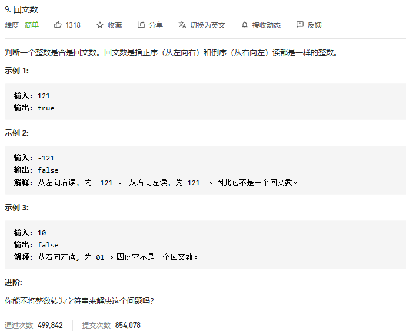

### leetcode_9_medium_回文数



```c++
class Solution {
public:
    bool isPalindrome(int x) {

    }
};
```

用x的后一半数字 构造一个数y。每当x从末尾移除一位数字，y就从末尾增加这个数字。理想情况下，x=y时，即为回文数

如何判断x已经移除了一半数字？ 当x<=y时，x的位数<=y的位数，即用掉了超过一半的数。有例外情况，即初始传入的x末尾为0时。在函数头加以判别

```c++
class Solution {
public:
	bool isPalindrome(int x) {
		int y;  //用x的后一半数字构造数
		if (x < 0)
			return false;

		if (x == 0)
			return true;
		if (x % 10 == 0)
			return false;
		y = 0;
		while (x > y)  //判断是否已经移除了一半数字
		{
			y *= 10;
			y += x % 10;
			x /= 10;
		}


		if (x == y || x == y / 10)  //注意数的位数为奇数的情况
			return true;
		else
			return false;
		return false;
	}
};
```

